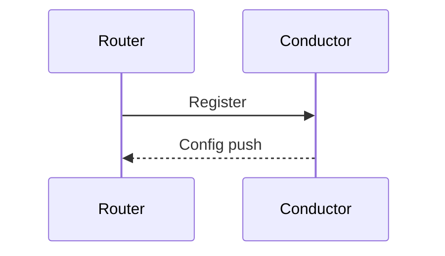

# Getting Started — SSR Docs Contributors

A first-day walkthrough for contributors (human or AI) making their first edit to the SSR / SSN documentation site.

For a static reference of paths and conventions, see [README.md](README.md).
For AI-agent rules, see [copilot-instructions.md](copilot-instructions.md).

---

## 1. Prerequisites

- **Docker** and **Docker Compose** with **≥ 4 GB** memory allocated to the Docker engine. The default 2 GB is not enough; the npm build will OOM. See the top-level [README.md](../README.md) for screenshots.
- **Git**.
- An editor with **MDX** support (VS Code with the MDX extension is fine).
- Optional: Node.js 20+ if you want to run scripts (`prettier`, `check-links`) outside Docker.

---

## 2. Clone and run locally

```bash
git clone git@github.com:128technology/docs.git
cd docs
docker-compose up
```

Open http://localhost:3000. The first build is slow (a few minutes); incremental rebuilds on save are fast.

To stop:

```bash
docker-compose down
```

If you add or remove an npm dependency, rebuild the image:

```bash
docker-compose down
docker rmi docs_docusaurus
docker-compose up
```

---

## 3. Repo tour (5 minutes)

| Look at | Why |
|---|---|
| [docs/](../docs/) | All published pages live here. |
| [docs/_install_prereqs.md](../docs/_install_prereqs.md) | Example of a partial (note the `_` prefix). |
| [kb/2024-04-24-I95-55904.md](../kb/2024-04-24-I95-55904.md) | Example KB article — frontmatter and structure to copy. |
| [sidebars.js](../sidebars.js) | Navigation tree. Pages are referenced by doc id. |
| [docusaurus.config.js](../docusaurus.config.js) | Site config. Note the `onBroken*: 'throw'` strict-build settings and Mermaid theme. |
| [static/img/](../static/img/) | Where images live. Reference as `/img/<file>`. |
| [.github/copilot-instructions.md](copilot-instructions.md) | The rules of the road. |

---

## 4. Make your first edit (existing page)

Pick a small fix in an existing page (typo, clarification, missing link).

1. Edit the file in [docs/](../docs/).
2. Save. Docusaurus hot-reloads at http://localhost:3000.
3. Verify the page renders and your change appears.
4. Commit on a feature branch and open a PR.

---

## 5. Add a new page

Worked example: a new configuration topic.

1. **Create the file**: `docs/configure_my_feature.md`

   ```markdown
   ---
   title: Configure my feature
   sidebar_label: My feature
   ---

   ## Overview

   …
   ```

2. **Register it in [sidebars.js](../sidebars.js)** — add the doc id (`"configure_my_feature"`) to the appropriate section. The id is the filename without the `.md` extension.

3. **Verify** — confirm the page appears in the sidebar at http://localhost:3000 and that internal links resolve. The build will throw on broken anchors, links, or images.

4. **Cross-link** — add a *Related topics* section linking to adjacent pages, and link to your new page from any obvious parent (concept page, install guide, etc.).

---

## 6. Add a KB article

Worked example: documenting a customer-reported issue.

Create `kb/2026-05-05-I95-99999.md`:

```markdown
---
title: Short, specific summary of the issue
date: 2026-05-05
tags: ['6.3', '6.3.2']
hide_table_of_contents: false
---

One-paragraph summary of the symptom and impact.

<!-- truncate -->

**Issue ID:** I95-99999
**Last Updated:** 2026-05-05
**Introduced in SSR Version:** 6.3.0
**Resolved in SSR Version:** 6.3.3

## Symptom

…

## Cause

…

## Workaround

…

## Resolution

…
```

KB articles are **not** added to [sidebars.js](../sidebars.js) — the [kb/](../kb/) blog-style plugin handles them automatically.

---

## 7. Use a partial (don't duplicate content)

If a section will appear in two or more pages, extract it into a partial.

1. Create `docs/_my_shared_section.md` (note the leading `_`).
2. In each consuming page, change the extension to `.mdx` (if it isn't already) and import:

   ```mdx
   ---
   title: My page
   ---

   import MyShared from './_my_shared_section.md';

   ## Some heading

   <MyShared />
   ```

3. Do **not** add `_my_shared_section` to [sidebars.js](../sidebars.js). Do **not** link to it directly.

Real example: [docs/_install_prereqs.md](../docs/_install_prereqs.md) is reused across multiple install guides.

---

## 8. Add a diagram

### Mermaid (preferred for sequence/flow/simple topology)

Mermaid is enabled in [docusaurus.config.js](../docusaurus.config.js) (`markdown.mermaid: true`, `themes: ['@docusaurus/theme-mermaid']`).

````markdown

````

Mermaid syntax reference: https://mermaid.js.org/intro/syntax-reference.html.

### SVG (preferred for complex topologies)

1. Author in Lucidchart.
2. Export as SVG.
3. Save under [static/img/](../static/img/).
4. Reference in markdown:

   ```markdown
   
   ```

Always provide alt text. Use PNG/GIF only when SVG is impractical (screen recordings).

---

## 9. Validate before pushing

```bash
docker-compose up
```

Required:

- No MDX compile errors.
- No `onBrokenAnchors`, `onBrokenMarkdownLinks`, or `onBrokenMarkdownImages` throws.
- Page renders at http://localhost:3000.
- New page appears in the sidebar (if registered).

Optional:

```bash
npm run prettier         # auto-format markdown and JS
npm run check-links      # link-audit the built site
```

If the build fails, fix it before pushing. Do not relax the strict-build settings.

---

## 10. Open a PR

1. Push your branch.
2. Open a PR against `master`.
3. [.github/CODEOWNERS](CODEOWNERS) auto-requests review from the docs owners for changes under `docs/**`.
4. Address review feedback; keep the build green.
5. Merge → publishes to https://docs.128technology.com.

PR checklist:

- [ ] `docker-compose up` is clean.
- [ ] New pages registered in [sidebars.js](../sidebars.js).
- [ ] Partials imported, not duplicated.
- [ ] Headings are Title Case.
- [ ] Code fences have language hints.
- [ ] Screenshots are scrubbed of customer data, real public IPs, and license keys.
- [ ] Cross-links to related KB / BCP / concept pages added.

---

## 11. Common pitfalls

| Symptom | Cause | Fix |
|---|---|---|
| Build OOMs in Docker | Docker memory < 4 GB | Increase Docker memory to ≥ 4 GB. |
| Build throws "broken anchor" | Heading text changed; link not updated | Update the link or rename the heading back. |
| Page doesn't appear in nav | Doc id missing from [sidebars.js](../sidebars.js) | Add the id. |
| "Cannot find module" on build | New npm dep not in image | `docker-compose down && docker rmi docs_docusaurus && docker-compose up`. |
| Linked partial 404s | Partials should never be linked | Import via MDX instead. |
| Heading rendered in sentence case | Style violation | Use Title Case. |
| Edit appears in the rendered site once but disappears on rebuild | You edited a file under [build/](../build/) | Edit the source under [docs/](../docs/) instead. |

---

## 12. For AI agents

- Read [.github/copilot-instructions.md](copilot-instructions.md) before editing.
- Run `docker-compose up` yourself; do not paste commands and ask the user to run them.
- If you lack terminal access, stop and ask the user to enable **run_in_terminal** via the **Configured Tools** control in the chat toolbar.
- Cite existing files for every PCLI command, config field, GUI path, or version claim. Do not invent.
- Stay in scope. Don't refactor unrelated pages.
