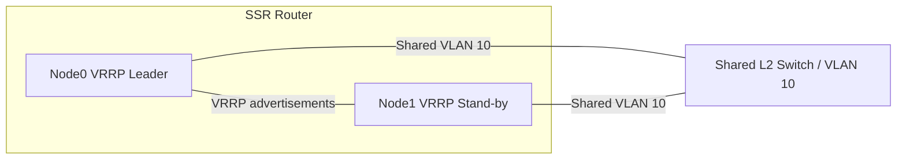

# Non-Revertive VRRP Failover

This document explains SSR non-revertive VRRP failover and how it differs from standard VRRP behavior.

## About This Guide

This guide is intended for SSR administrators and HA engineers who want to deploy VRRP on redundant interfaces without automatic revertive failback.

Non-revertive VRRP is useful when the preferred interface should not automatically regain Active status after it returns, avoiding premature failback and traffic disruption.

## What is Non-Revertive VRRP?

Standard VRRP uses priority to choose the Leader. A node that becomes Stand-by returns to Leader only when it stops receiving higher-priority advertisements.

Non-revertive VRRP keeps the currently active node as the Leader even after the preferred interface comes back up, unless the standby node loses VRRP reachability.

This minimizes traffic disruption during router restart or node recovery, especially when a node may not yet be ready to forward packets after taking back the interface.

## Why SSR needs a special tie-breaker

When both VRRP interfaces use the same priority, the SSR must determine which interface becomes Leader.

The SSR does not use the RFC Primary Address tie-breaker in the current implementation. Instead, non-revertive VRRP uses a new tie-breaker based on the interface uptime encoded in the VRRP advertisement.

### Tie-breaker rules

When a Leader receives an advertisement with equal priority:

- if the advertised uptime is greater than local uptime, the local Leader transitions to Stand-by
- if the advertised uptime is equal to local uptime, the node name is used as the final tie-breaker
- otherwise, the Leader ignores the advertisement and remains Leader

## Supported deployment

Non-revertive VRRP is supported only for SSR HA deployments where:

- both VRRP interfaces belong to different nodes under the same router
- both nodes are SSR routers
- no non-SSR routers participate in the same VRRP group

### Topology diagram



:::note
The SSR validates supported cases and will block unsupported configurations. It is still the customer’s responsibility to avoid VRRP deployments with non-SSR routers when using this feature.
:::

## Example SSR configuration

The following example demonstrates `non-revertive true` under the `vrrp` configuration block:

```text
node node0
    device-interface dev-1
        vrrp
            enabled true
            vrid 10
            priority 100
            vlan 10
            advertisement-interval 1000
            non-revertive true
        exit
        network-interface net-1
            vlan 10
            address 172.16.1.101/24
        exit
        network-interface net-2
            vlan 20
            address 172.16.2.101/24
        exit
    exit
exit

node node1
    device-interface dev-1
        vrrp
            enabled true
            vrid 10
            priority 50
            vlan 10
            advertisement-interval 1000
            non-revertive true
        exit
        network-interface net-1
            vlan 10
            address 172.16.1.101/24
        exit
        network-interface net-2
            vlan 20
            address 172.16.2.101/24
        exit
    exit
exit
```

## How the feature works

### Advertisement interval and timers

The SSR follows VRRP timing rules from the RFC:

- `advertisement-interval` is configured in milliseconds
- internally, the SSR normalizes this interval to centiseconds
- the skew and active-down timer are derived from the configured priority and advertisement interval

The active-down timer is calculated as:

```text
Active Down Timer = (3 * Advertisement Interval) + Skew
Skew = ((256 - Priority) * Advertisement Interval) / 256
```

### Uptime encoding in the VRRP packet

The SSR encodes interface uptime inside the VRRP advertisement using the VRRP IPvX Address(es) field.

For IPv4 interfaces, uptime is translated into two IPv4 addresses and appended after the interface address list. For IPv6 interfaces, uptime is encoded into one IPv6 address, with the first half of bits set to zero.

The `Count IPvX Addr` field is updated to reflect the additional address entries.

### Receiving advertisements

When non-revertive VRRP is enabled and an advertisement is received:

1. parse the last address entries from `IPvX Address(es)` as uptime
2. convert the encoded address(es) back to a device uptime value
3. compare the advertised uptime to the local uptime
4. use the rules above to decide whether the local Leader should transition to Stand-by

## Interface state model

The SSR follows the standard VRRP state model with these states:

- `Initial`
- `Leader`
- `Stand-by`

### Leader behavior

While Leader:

- send advertisements at each advertisement interval
- compare received advertisements to local values
- if the advertisement priority is greater, transition to Stand-by
- if the advertisement priority is equal, use uptime and node name tie-breakers
- otherwise, ignore the advertisement

### Stand-by behavior

While Stand-by:

- start the active-down timer
- if the timer expires, transition to Leader
- if an advertisement is received with priority greater than or equal to local priority, reset the active-down timer

## Operational guidance

Use non-revertive VRRP when you want the active path to remain active after recovery rather than allowing the original preferred node to preempt the active node.

This is typically the best practice when:

- the secondary node may take longer to become fully operational after failover
- the preferred node can cause traffic disruption if it resumes too early
- you want consistent forwarding from the node currently elected Leader

:::note
Non-revertive VRRP is generally recommended for SSR deployments that use VRRP with shared interfaces and dual-node redundancy.
:::

## Limitations and guardrails

The feature is intentionally restricted to SSR-only, same-router deployments. It does not support mixed environments with external non-SSR routers.

The feature is enabled by setting `non-revertive true` under the `vrrp` configuration block.

If the SSR nodes use equal priority and equal up-time, the node name is used as the last tie-breaker.

## Summary

Non-revertive VRRP prevents automatic failback to the preferred node after a recovery event. It uses uptime-based tiebreaking in VRRP advertisements so SSR routers can choose a stable Leader without relying on the standard Primary Address tie-breaker.

This reduces packet loss and session disruption when VRRP restarts occur while one node is still initializing.
