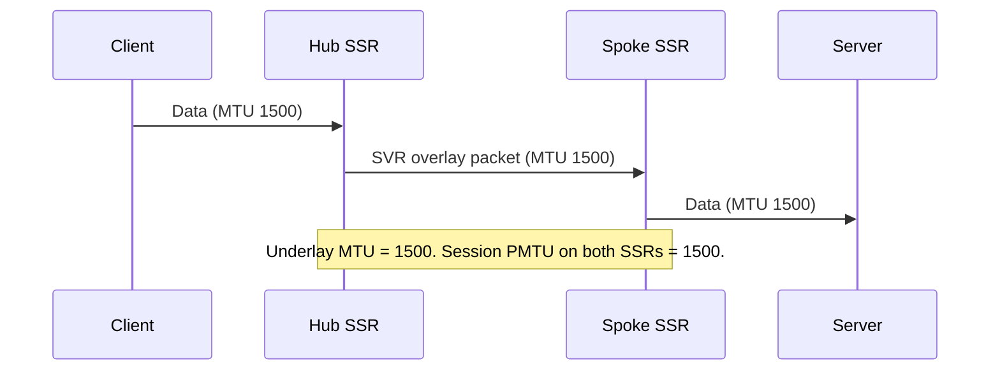
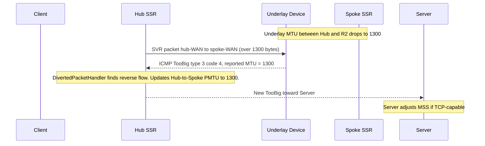

The SSR performs Path MTU Discovery (PMTUD) along the overlay to determine the correct maximum transmission unit (MTU) for each peer path. By default, this test runs every ten minutes. If a change in the underlay reduces the available path MTU between two SSRs, the new value is not discovered until the next PMTUD cycle. Additionally, existing sessions continue to use the previous MTU value until the next time those sessions are rebuilt.

| Direction | Port/Proto | Client Payload (bytes) | Server Payload (bytes) | Default Interval | Notes |
| --- | --- | --- | --- | --- | --- |
| bidirectional | 1280/UDP   | 2945 | 90  | 600s | Interval is configurable within `path-mtu-discovery/interval`, or disabled `path-mtu-discovery/enabled`. |

Peering SSR routers will perform path MTU discovery on each peer path between each other. This test is run every ten (10) minutes by default, to adjust in the event of path changes between peering devices. During the test, SSR routers send packets of various sizes to discover the MTU of the path. However, in some government deployments the use of MTU discovery is not possible. 

In order to accommodate these deployments where “ICMP Destination Unreachable - Fragmentation Needed” response messages are not generated (RFC1911 is not followed), three successive non-responses are considered equivalent to ICMP responses for the purposes of driving the algorithm with an inferred MTU.

The discovered MTU is viewable in the output of `show peers`. 

Devices in the underlay may report an ICMP Destination Unreachable / Fragmentation Needed (type 3, code 4) error, referred to here as a _TooBig_ packet, to indicate they could not forward a packet due to an undersized MTU. Prior to SSR 7.2.0, these messages were forwarded to the correct endpoint, but the SSR itself did not act on the MTU value contained in the message, leaving existing sessions with an incorrect PMTU.

SSR 7.2.0 introduces two complementary enhancements to address the gaps mentioned above:

1. **Underlay ICMP reaction** — When the SSR receives a TooBig packet from the underlay, it updates the affected overlay flow and generates a corrected TooBig packet toward the original packet sender, allowing the sender to adjust its segment size.

2. **Session Refresh** - The flow which was traversed to trigger the TooBig response from the underlay is now updated to use the MTU reported in the TooBig packet.

For TCP flows, setting `enforced-mss automatic` on the egress `network-interface` is the recommended complement to these features. It adjusts the TCP MSS advertised at the interface boundary to avoid fragmentation in the first place. See [Configuration](#configuration) for details.

## How The SSR Reacts to Underlay ICMP TooBig Messages

The following sequence illustrates what happens when the underlay path MTU changes after a session is already established.

### Initial State



The client and server are communicating through two peering SSRs over the overlay. The PMTU is consistent at 1500 across all hops, and both SSRs have applied an MTU of 1500 to the forward flow actions for this session.

### Underlay MTU Drops — First TooBig Received by Hub



When R2 (an underlay device) cannot forward an oversized packet, it sends a TooBig packet to the Hub's WAN interface. The SSR processes this message and does the following:

1. It extracts the encapsulated IP header from the TooBig body to identify the affected overlay session.
2. It finds the reverse flow using that header and updates the Hub → Spoke forward flow's PMTU to the value reported by the underlay.
3. It constructs a new TooBig packet directed toward the original packet sender (the Server), so the server's TCP stack can reduce its MSS.

:::note
The MTU value propagated in the new TooBig packet reflects the underlay-reported value. On paths with encryption, HMAC, FEC, or BFD tunneling overhead, the effective usable MTU will be lower than the raw underlay value. The SSR accounts for these overheads when setting the MTU on forward flow actions.
:::

## Fabric Fragmentation and Oversize Packet Behavior

When the PMTU on an overlay (SVR/fabric) path is lower than the MTU of the segment immediately preceding the Hub, packets larger than the PMTU will require fragmentation along the overlay. The SSR always fragments fabric packets when necessary, even when the incoming packet carries the Don't Fragment (DF) bit. This preserves packet delivery but prevents the sender from learning about the smaller path MTU and adjusting its segment size.

:::note
For TCP traffic, setting `enforced-mss automatic` on the egress `network-interface` is the most reliable way to avoid this scenario. When set, the SSR rewrites the TCP MSS at the interface boundary to match the session MTU (including the path MTU for SVR sessions). This is commonly known as `MSS Clamping` and is not the default; it must be explicitly configured.
:::

## Configuration

### Configuring `enforced-mss` (Recommended for TCP)

Set `enforced-mss` to `automatic` on egress interfaces to avoid fabric fragmentation for TCP traffic. The SSR calculates the correct MSS from the interface or path MTU for SVR sessions.

```
config
    authority
        router  <router-name>
            node  <node-name>
                device-interface  <device-interface-name>
                    network-interface  <network-interface-name>
                        enforced-mss  automatic
                    exit
                exit
            exit
        exit
    exit
exit
```

### Configuring PMTUD Interval

The PMTUD interval (how frequently the SSR probes each overlay path) is configurable at the router level and can be overridden per neighborhood or per adjacency.

```
config
    authority
        router  <router-name>
            path-mtu-discovery
                enabled   true
                interval  600
            exit
        exit
    exit
exit
```

| Field | Default | Description |
| ----- | ------- | ----------- |
| `enabled` | `true` | Enables or disables PMTUD for this router. |
| `interval` | `600` | Seconds between PMTUD tests. Valid range: 1–86400. |

To override the interval for a specific adjacency:

```
config
    authority
        router  <router-name>
            node  <node-name>
                device-interface  <device-interface-name>
                    network-interface  <network-interface-name>
                        adjacency  <ip-address>
                            path-mtu-discovery
                                enabled   true
                                interval  300
                            exit
                        exit
                    exit
                exit
            exit
        exit
    exit
exit
```

## Verification

Use `show peers` to confirm the currently discovered path MTU for each peer path:

```text
admin@node1.router1# show peers
Peer                      Node       Network Interface    Destination      Status    Hostname      Path MTU
------------------------  ---------  -------------------  ---------------  --------  ------------  ----------
router2                   node1      wan0                 192.0.2.10       Up        router2.lab   1300
```

A `Path MTU` value of `0` indicates PMTUD is disabled or has not yet completed a test cycle.

The [`show stats icmp flow-mtu-updates`](cli_stats_reference.md#show-stats-icmp-flow-mtu-updates) provides a count of flows that have had their MTU updated at runtime via a TooBig packet. This counter is reset when the system resets (not persisted).

## Troubleshooting

- If the path MTU shown by `show peers` does not reflect the expected value, verify that `path-mtu-discovery > enabled` is `true` on both sides of the adjacency.
- If TCP sessions continue to fragment after configuring `enforced-mss automatic`, confirm the setting is applied to the correct egress interface and that both peers have completed a PMTUD cycle.

## Related Topics

- [Concepts: Machine to Machine Communication](concepts_machine_communication.md) — path MTU discovery protocol details and BFD traffic patterns.
- [Configuration Reference Guide](config_reference_guide.md) — full parameter reference for `path-mtu-discovery`, `enforced-mss`, and `session-resiliency`.
- [Configuring Session Recovery Detection](config_session_recovery.md) — session health-check and flow rebuild mechanisms.
- [Configuring Forward Error Correction](config_forward_error_correction.md) — complementary resiliency feature for packet loss.
