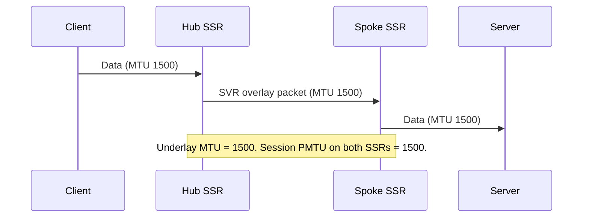
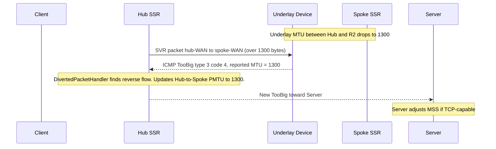

#### Version History

| Release | Modification |
| ------- | ------------ |
| 7.2.0   | Feature introduced |

## Overview

The SSR performs Path MTU Discovery (PMTUD) along the overlay to determine the correct maximum transmission unit (MTU) for each peer path. By default, this test runs every ten minutes. If a change in the underlay reduces the available path MTU between two SSRs, the new value is not discovered until the next PMTUD cycle. Additionally, existing sessions continue to use the previous MTU value until the next time those sessions are rebuilt.

Devices in the underlay may report an ICMP Destination Unreachable / Fragmentation Needed (type 3, code 4) error—referred to here as a _TooBig_ packet—to indicate they could not forward a packet due to an undersized MTU. Prior to SSR 7.2.0, these messages were forwarded to the correct endpoint, but the SSR itself did not act on the MTU value contained in the message, leaving existing sessions with an incorrect PMTU.

SSR 7.2.0 introduces two complementary enhancements to address these gaps:

1. **Underlay ICMP reaction** — When the SSR receives a TooBig packet from the underlay, it updates the affected overlay flow and generates a corrected TooBig packet toward the original packet sender, allowing the sender to adjust its segment size.
2. **PMTUD-triggered session refresh** — When a periodic PMTUD cycle discovers a new path MTU, existing sessions that are eligible for flow-move are refreshed to use the new value on the next packet.

For TCP flows, setting `enforced-mss automatic` on the egress `network-interface` is the recommended complement to these features. It adjusts the TCP MSS advertised at the interface boundary to avoid fragmentation in the first place. See [Configuration](#configuration) for details.

## How The SSR Reacts to Underlay ICMP TooBig Messages

The following sequence illustrates what happens when the underlay path MTU changes after a session is already established.

### Initial State



The client and server are communicating through two peering SSRs over the overlay. The PMTU is consistent at 1500 across all hops, and both SSRs have applied an MTU of 1500 to the forward flow actions for this session.

### Underlay MTU Drops — First TooBig Received by Hub



When R2 (an underlay device) cannot forward an oversized packet, it sends a TooBig packet to the Hub's WAN interface. The SSR's `DivertedPacketHandler` processes this message:

1. It extracts the encapsulated IP header from the TooBig body to identify the affected overlay session.
2. It finds the reverse flow using that header and updates the Hub → Spoke forward flow's PMTU to the value reported by the underlay.
3. It constructs a new TooBig packet directed toward the original packet sender (the Server), so the server's TCP stack can reduce its MSS.

:::note
The MTU value propagated in the new TooBig packet reflects the underlay-reported value. On paths with encryption, HMAC, FEC, or BFD tunneling overhead, the effective usable MTU will be lower than the raw underlay value. The SSR accounts for these overheads when setting the MSS on forward flow actions.
:::

## Fabric Fragmentation and Oversize Packet Behavior

When the PMTU on an overlay (SVR/fabric) path is lower than the MTU of the segment immediately preceding the Hub, packets larger than the PMTU will require fragmentation along the overlay. The SSR always fragments fabric packets when necessary, even when the incoming packet carries the Don't Fragment (DF) bit. This preserves packet delivery but prevents the sender from learning about the smaller path MTU and adjusting its segment size.

:::note
For TCP traffic, setting `enforced-mss automatic` on the egress `network-interface` is the most reliable way to avoid this scenario. When set, the SSR rewrites the TCP MSS at the interface boundary to match the session MTU (including the path MTU for SVR sessions). This is not the default and must be explicitly configured.
:::

### Oversize Fabric Packet Behavior

To allow the sender an opportunity to adjust before fragmenting, you can configure `oversize-fabric-packet-behavior` on either a `network-interface` or a `service-policy`. When enabled, the SSR behavior changes as follows:

| Setting | Behavior |
| ------- | -------- |
| `false` (default) | Oversized fabric packets are fragmented immediately, matching the current behavior. |
| `true` | The oversized fabric packet is **dropped**, and a TooBig packet is generated toward the sender. This is attempted up to N times per flow. If the sender does not reduce its packet size within those attempts, the SSR falls back to fragmenting. |

This is a best-effort mechanism. Traffic continues over the overlay (via fragmentation) if the sender does not adjust.

:::note
Packets that do not carry the DF bit fragment immediately regardless of this setting. Only packets that would otherwise be fragmented on an SVR path are subject to this behavior.
:::

#### Configuration Location

`oversize-fabric-packet-behavior` can be configured at two locations, with different trade-offs:

| Location | Benefit | Consideration |
| -------- | ------- | ------------- |
| `network-interface` | Co-located with `mtu` and `enforced-mss`; applies to all traffic egressing that interface. | Applies to all services on the path, independent of individual service requirements. |
| `service-policy` | Per-service control; different services can have different behaviors. | Applies regardless of which egress interface is selected; a flow-move to a different interface may produce unexpected behavior if the interfaces are not configured consistently. |

## Configuration

### Enabling Oversize Fabric Packet Behavior

#### On a `network-interface`

```
config
    authority
        router  <router-name>
            node  <node-name>
                device-interface  <device-interface-name>
                    network-interface  <network-interface-name>
                        oversize-fabric-packet-behavior  true
                    exit
                exit
            exit
        exit
    exit
exit
```

#### On a `service-policy`

```
config
    authority
        service-policy  <policy-name>
            oversize-fabric-packet-behavior  true
        exit
    exit
exit
```

### Configuring `enforced-mss` (Recommended for TCP)

Set `enforced-mss` to `automatic` on egress interfaces to avoid fabric fragmentation for TCP traffic. The SSR calculates the correct MSS from the interface or path MTU for SVR sessions.

```
config
    authority
        router  <router-name>
            node  <node-name>
                device-interface  <device-interface-name>
                    network-interface  <network-interface-name>
                        enforced-mss  automatic
                    exit
                exit
            exit
        exit
    exit
exit
```

### Configuring PMTUD Interval

The PMTUD interval (how frequently the SSR probes each overlay path) is configurable at the router level and can be overridden per neighborhood or per adjacency.

```
config
    authority
        router  <router-name>
            path-mtu-discovery
                enabled   true
                interval  600
            exit
        exit
    exit
exit
```

| Field | Default | Description |
| ----- | ------- | ----------- |
| `enabled` | `true` | Enables or disables PMTUD for this router. |
| `interval` | `600` | Seconds between PMTUD tests. Valid range: 1–86400. |

To override the interval for a specific adjacency:

```
config
    authority
        router  <router-name>
            node  <node-name>
                device-interface  <device-interface-name>
                    network-interface  <network-interface-name>
                        adjacency  <ip-address>
                            path-mtu-discovery
                                enabled   true
                                interval  300
                            exit
                        exit
                    exit
                exit
            exit
        exit
    exit
exit
```

### Enabling Session Refresh on PMTU Change

When a PMTUD cycle discovers a new path MTU, the SSR can automatically refresh existing sessions on that path so they adopt the new MTU value without waiting for a manual rebuild. This requires the affected sessions to be eligible for flow-move, which is controlled by the `session-resiliency` setting in the associated `service-policy`.

Set `session-resiliency` to either `failover` or `revertible-failover` to enable this behavior:

```
config
    authority
        service-policy  <policy-name>
            session-resiliency  revertible-failover
        exit
    exit
exit
```

When a new PMTU is discovered, the SSR issues a `PathMtuChangeEvent` for the affected path. On the next packet for any eligible session using that path, the SSR diverts the packet to the service area for flow modification, applying the new PMTU. Sessions with `session-resiliency none` are not refreshed and will continue using the previous PMTU value until they are rebuilt by another event.

---

## Verification

Use `show peers` to confirm the currently discovered path MTU for each peer path:

```text
admin@node1.router1# show peers
Peer                      Node       Network Interface    Destination      Status    Hostname      Path MTU
------------------------  ---------  -------------------  ---------------  --------  ------------  ----------
router2                   node1      wan0                 192.0.2.10       Up        router2.lab   1300
```

A `Path MTU` value of `0` indicates PMTUD is disabled or has not yet completed a test cycle.

## Troubleshooting

- If the path MTU shown by `show peers` does not reflect the expected value, verify that `path-mtu-discovery > enabled` is `true` on both sides of the adjacency.
- If TCP sessions continue to fragment after configuring `enforced-mss automatic`, confirm the setting is applied to the correct egress interface and that both peers have completed a PMTUD cycle.
- If existing sessions are not picking up a new PMTU after a PMTUD cycle, verify the `service-policy` for those sessions has `session-resiliency` set to `failover` or `revertible-failover`.

## Related Topics

- [Concepts: Machine to Machine Communication](concepts_machine_communication.md) — path MTU discovery protocol details and BFD traffic patterns.
- [Configuration Reference Guide](config_reference_guide.md) — full parameter reference for `path-mtu-discovery`, `enforced-mss`, and `session-resiliency`.
- [Configuring Session Recovery Detection](config_session_recovery.md) — session health-check and flow rebuild mechanisms.
- [Configuring Forward Error Correction](config_forward_error_correction.md) — complementary resiliency feature for packet loss.
