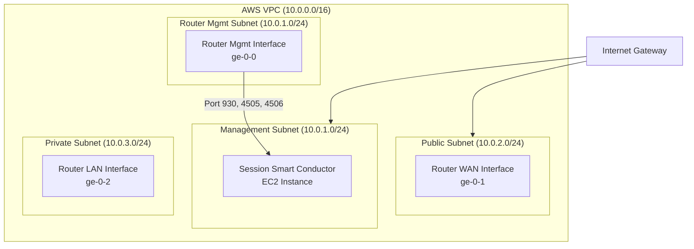

import AwsAccountSetup from './_aws_account_setup.md';
import AwsVpcSetup from './_aws_vpc_setup.md';
import AwsKeypair from './_aws_keypair.md';
import AwsSecurityGroups from './_aws_security_groups.md';
import AuthorityName from './_set_authority_name.md';
import SetConductorIP from './_set_conductor_ip.md';
import ChangeDefaultPasswords from './_change_def_passwords.md';
import NextStepsConfig from './_conductor_install_nextsteps.md';

This guide walks through deploying a complete Juniper Session Smart Router (SSR) solution in AWS using the **BYOL (Bring Your Own License)** model with a **Conductor-managed** architecture. When you complete this guide, you will have:

- An AWS account and VPC configured for SSR
- A Session Smart Conductor deployed and configured
- A Session Smart Router deployed and onboarded to the Conductor
- A baseline working configuration verified end-to-end

## Prerequisites

Before you begin, confirm you have:

- A Juniper account with Artifactory credentials (username and token) for accessing SSR software repositories. Contact your Juniper Sales representative if you do not have these.
- The SSR software version you want to deploy. Your Juniper Sales representative can advise if you are unsure.
- AWS CLI installed on your local workstation (optional, for CLI-based deployment). See the [AWS CLI installation guide](https://docs.aws.amazon.com/cli/latest/userguide/getting-started-install.html).

---

## Step 1: Set Up Your AWS Account

<AwsAccountSetup/>

---

## Step 2: Plan Your Deployment

The following diagram illustrates the AWS infrastructure deployed by this guide:



### Deployment Summary

| Component | AWS Resource | Subnet | Notes |
| --------- | ------------ | ------ | ----- |
| Conductor | EC2 instance | Management | Single NIC; SSH + HTTPS inbound |
| Router management interface | EC2 NIC | Management | Connects back to Conductor |
| Router WAN interface | EC2 NIC | Public | External/peer connectivity |
| Router LAN interface | EC2 NIC | Private | Internal workload connectivity |

---

## Step 3: Create AWS Infrastructure

### 3.1 Create VPC, Subnets, and Routing

<AwsVpcSetup/>

### 3.2 Create an EC2 Key Pair

<AwsKeypair/>

### 3.3 Create Security Groups

<AwsSecurityGroups/>

---

## Step 4: Subscribe to the SSR BYOL Marketplace Offering

1. Open the [Session Smart Networking Platform BYOL](https://aws.amazon.com/marketplace/pp/prodview-lz6cjd43qgw3c?sr=0-2&ref_=beagle&applicationId=AWSMPContessa) listing in the AWS Marketplace.
2. Click **Continue to Subscribe**.
3. Review and accept the terms and conditions.
4. Click **Continue to Configuration**.

:::note
There is no software cost associated with the BYOL image. You pay only for the AWS EC2 compute resources. Software licensing is handled through your Artifactory credentials.
:::

### Requesting a Private Offer

If your environment has no outbound internet access to the SSR repositories, you can request a Private Offer instead:

1. Locate your AWS Account ID:
   - Open the [AWS Console](https://console.aws.amazon.com).
   - Click the dropdown next to your username at the top right; the Account ID is displayed.
   - Make a note of the Account ID.
2. Contact your Juniper Networks Sales representative and provide:
   - Your AWS Account ID
   - The SSR software version required for your deployment
3. Your Juniper Sales representative will email you the private offer.
4. Open the email and accept the terms and conditions to activate the offer.

---

## Step 5: Deploy the Session Smart Conductor

A Conductor must be deployed before any managed routers. The Conductor is a single EC2 instance with one network interface connected to the management subnet.

### 5.1 Launch via AWS Console (CloudFormation)

1. From the BYOL offering, click **Continue to Configuration**.
2. In the **Fulfillment Option** dropdown, select **CloudFormation Template**.
3. Select the **Juniper Session Smart Conductor** template.
4. Select your target region and click **Continue to Launch**.
5. In the **Choose Action** dropdown, select **Launch CloudFormation**, then click **Launch**.
6. The CloudFormation stack creation wizard opens. Fill in the stack parameters:

   | Parameter | Value |
   | --------- | ----- |
   | Stack name | A descriptive name, for example `ssr-conductor` |
   | Name | Instance name, for example `conductor` |
   | Instance Type | Select from the [supported instance sizes](deploy_aws.md#supported-aws-instance-types). `c5.xlarge` is recommended for small deployments |
   | SSR Version | The SSR software version to install (for example `6.3.5-1`) |
   | Artifactory Username | Your Artifactory username |
   | Artifactory Token | Your Artifactory token |
   | VPC ID | Select your `ssr-vpc` |
   | Control Subnet ID | Select `ssr-mgmt-subnet` |
   | Control Subnet Allowed CIDR | The CIDR of the management subnet (`10.0.1.0/24`) |
   | Admin Allowed CIDR | Your admin workstation CIDR |
   | Key Name | Select `ssr-keypair` |

7. Click **Next** through the options pages, then click **Create stack**.


8. Monitor the stack creation under the **Events** tab. When the status shows `CREATE_COMPLETE`, proceed to the **Outputs** tab.
9. Note the following values from the **Outputs** tab:
   - **HTTPSLogin** — the URL to access the Conductor GUI
   - **PublicEIP** — the public IP address of the Conductor instance

:::note
After the CloudFormation stack reports `CREATE_COMPLETE`, allow an additional **10–15 minutes** for the BYOL SSR software installation to complete before attempting to log in.
:::

### 5.2 Launch via AWS CLI (CloudFormation)

If you prefer to deploy programmatically, follow the CloudFormation console steps 1–7 above to reach the template URL, then copy the **Amazon S3 URL** of the template.

Create a parameters file `conductor.parameters.json`:

```bash
vi conductor.parameters.json
```

Paste and adjust the following JSON:

```json
{
  "Name": "<instance-name>",
  "Version": "<ssr-version>",
  "InstanceType": "c5n.xlarge",
  "ArtifactoryUsername": "<username>",
  "ArtifactoryPassword": "<password>",
  "VpcId": "<vpc-id>",
  "ControlSubnet": "<mgmt-subnet-id>",
  "ControlAllowedCidr": "10.0.1.0/24",
  "AdminAllowedCidr": "<your-admin-cidr>",
  "KeyName": "ssr-keypair"
}
```

Deploy the stack:

```bash
aws cloudformation create-stack \
  --stack-name ssr-conductor \
  --template-url <S3-template-URL> \
  --parameters file://conductor.parameters.json \
  --capabilities CAPABILITY_IAM
```

Monitor deployment status:

```bash
aws cloudformation describe-stacks \
  --stack-name ssr-conductor \
  --query 'Stacks[0].StackStatus'
```

### 5.3 Manual Deployment (Without CloudFormation)

If you prefer not to use CloudFormation templates, you can launch the EC2 instance directly:

1. In the AWS Console, navigate to **EC2** and click **Launch Instance**.
2. Under **Application and OS Images**, click **Browse more AMIs**, search for `Session Smart Networking Platform BYOL`, and select the image.
3. Choose an instance type (see [supported sizes](deploy_aws.md#supported-aws-instance-types)).
4. Under **Key pair**, select `ssr-keypair`.
5. Under **Network settings**, click **Edit**:
   - Select your `ssr-vpc`
   - Select `ssr-mgmt-subnet`
   - Select `ssr-conductor-sg` as the security group
6. Under **Configure storage**, ensure at least **128 GB** is allocated.
7. Expand **Advanced details** and populate the **User data** field with the cloud-init configuration below to automate onboarding:

```yaml
#cloud-config
write_files:
  - path: /etc/128T-hardware-bootstrapper/onboarding-config.json
    content: |
        {
            "name": "<conductor-name>",
            "ssr-version": "<version>",
            "mode": "conductor",
            "artifactory-user": "<username>",
            "artifactory-password": "<password>",
            "node-name": "node0",
            "cloud-provider": "aws"
        }
```

| Field | Description |
| ----- | ----------- |
| `name` | The name to assign to this Conductor |
| `ssr-version` | SSR software version to install (for example `6.3.5-1`) |
| `artifactory-user` | Your Artifactory username |
| `artifactory-password` | Your Artifactory token/password |
| `node-name` | For a standalone Conductor, use `node0` |

8. Click **Launch instance**.

If you do not provide user data, run onboarding manually after the instance starts:

```bash
ssh -i ~/.ssh/ssr-keypair.pem ec2-user@<conductor-public-ip>
sudo /usr/libexec/hardwareBootstrapper128t config-generator
```

Follow the prompts. The instance will reboot once when onboarding completes.

---

## Step 6: Log In to the Conductor

1. Navigate to the HTTPS URL from the CloudFormation Outputs tab (or `https://<conductor-public-ip>`).

   :::note
   The Conductor uses a self-signed certificate by default. If your browser warns about an unsafe connection, you can safely proceed for initial setup. See [Configure Custom TLS Certificates](config_custom_certs.md) to install a trusted certificate.
   :::

2. Log in with the default credentials:
   - **Username:** `admin`
   - **Password:** `128Tadmin`

### Change Default Passwords

<ChangeDefaultPasswords/>

---

## Step 7: Configure the Conductor

### 7.1 Set the Authority Name

<AuthorityName/>

Complete the authority name change by clicking **VALIDATE** and then **COMMIT**.

### 7.2 Set the Conductor IP Address

<SetConductorIP/>

The Conductor's public IP address (from the CloudFormation Outputs or the EC2 console) is the address managed routers will use to connect. This must be set before deploying any routers.

### 7.3 Add a Software Access Token (optional, for on-premises upgrades)

If you require the ability to upgrade SSR software or deploy on-premises routers, add your Artifactory token to the Conductor. This propagates to all managed routers.

SSH to the Conductor and run:

```bash
ssh -i ~/.ssh/ssr-keypair.pem t128@<conductor-public-ip>
```

Then from the PCLI:

```bash
pcli
set software access-token <your-artifactory-username> <your-artifactory-token>
```

### 7.4 Create a Basic Configuration

Before deploying routers, create the minimum required configuration on the Conductor: an Authority, at least one Service, and a Tenant.

For a step-by-step walkthrough, see [Configure the Conductor](intro_basic_conductor_config.md).

A default configuration template is also available on the Conductor:

1. Log in to the Conductor GUI and navigate to **Configuration**.
2. Select **Templates** and browse the available default templates.
3. Apply a template as the starting point for your deployment. See [Configuration Templates](config_templates.md#default-templates) for details.

---

## Step 8: Deploy the Session Smart Router

With the Conductor running and configured, deploy the router. The router uses three network interfaces (management, WAN, and LAN) attached to the corresponding subnets.

### 8.1 Enable Enhanced Networking (ENA)

Before launching the router instance, enable ENA support on the AMI to achieve maximum throughput. Run the following from your local workstation:

```bash
aws ec2 modify-instance-attribute \
  --instance-id <router-instance-id> \
  --ena-support
```

:::note
If you are using the CloudFormation template, ENA is configured automatically.
:::

### 8.2 Launch via AWS Console (CloudFormation)

1. Return to the BYOL marketplace offering and click **Continue to Configuration**.
2. In the **Fulfillment Option** dropdown, select **CloudFormation Template**.
3. Select the **Juniper Session Smart Conductor Managed Router** template.
4. Select your target region and click **Continue to Launch**.
5. In the **Choose Action** dropdown, select **Launch CloudFormation**, then click **Launch**.
6. Fill in the stack parameters:

   | Parameter | Value |
   | --------- | ----- |
   | Stack name | For example `ssr-router-1` |
   | Router Name | For example `branch-router-1` |
   | Instance Type | Select from [supported sizes](deploy_aws.md#supported-aws-instance-types) |
   | SSR Version | Must match or be lower than the Conductor version |
   | Artifactory Username | Your Artifactory username |
   | Artifactory Token | Your Artifactory token |
   | VPC ID | Select your `ssr-vpc` |
   | Management Subnet ID | Select `ssr-mgmt-subnet` |
   | Public Subnet ID | Select `ssr-public-subnet` |
   | Private Subnet ID | Select `ssr-private-subnet` |
   | Conductor Primary IP | The private IP of your Conductor from Step 5 |
   | Key Name | Select `ssr-keypair` |

7. Click **Next**, then **Create stack**.


8. Wait for `CREATE_COMPLETE`. Allow an additional **10–15 minutes** for BYOL installation to complete.

### 8.3 Launch via AWS CLI (CloudFormation)

Create `router.parameters.json`:

```json
{
  "RouterName": "<router-name>",
  "Version": "<ssr-version>",
  "InstanceType": "c5n.xlarge",
  "ArtifactoryUsername": "<username>",
  "ArtifactoryPassword": "<password>",
  "VpcId": "<vpc-id>",
  "ManagementSubnet": "<mgmt-subnet-id>",
  "PublicSubnet": "<public-subnet-id>",
  "PrivateSubnet": "<private-subnet-id>",
  "ConductorPrimaryIp": "<conductor-private-ip>",
  "AdminAllowedCidr": "<your-admin-cidr>",
  "KeyName": "ssr-keypair"
}
```

Deploy:

```bash
aws cloudformation create-stack \
  --stack-name ssr-router-1 \
  --template-url <S3-template-URL> \
  --parameters file://router.parameters.json \
  --capabilities CAPABILITY_IAM
```

### 8.4 Manual Deployment (Without CloudFormation)

1. In the AWS Console, navigate to **EC2** → **Launch Instance**.
2. Search for and select the **Session Smart Networking Platform BYOL** AMI.
3. Choose an instance type.
4. Under **Network settings**, click **Edit** and configure **three** network interfaces:

   | Interface | Subnet | Security Group |
   | --------- | ------ | -------------- |
   | eth0 (primary) | `ssr-mgmt-subnet` | `ssr-router-sg` |
   | eth1 | `ssr-public-subnet` | `ssr-router-sg` |
   | eth2 | `ssr-private-subnet` | `ssr-router-sg` |

5. Expand **Advanced details** and populate **User data** for automatic onboarding:

```yaml
#cloud-config
write_files:
  - path: /etc/128T-hardware-bootstrapper/onboarding-config.json
    content: |
        {
            "name": "<router-name>",
            "ssr-version": "<version>",
            "mode": "conductor-managed",
            "artifactory-user": "<username>",
            "artifactory-password": "<password>",
            "conductor-hosts": ["<conductor-private-ip>"],
            "cloud-provider": "aws"
        }
```

| Field | Description |
| ----- | ----------- |
| `name` | The router name (must match the configured router in the Conductor) |
| `ssr-version` | SSR software version to install |
| `conductor-hosts` | List of Conductor IP addresses (use the private IP) |

6. Click **Launch instance**.

### 8.5 Network Interface Layout

The router template deploys the EC2 instance with network interfaces attached in the following order. Use these names in your Conductor or Mist configuration:

**With management interface (recommended):**

| SSR Interface Name | EC2 Interface | Subnet |
| ------------------ | ------------- | ------ |
| `ge-0-0` | eth0 | Management |
| `ge-0-1` | eth1 | Public (WAN) |
| `ge-0-2` | eth2 | Private (LAN) |

**Without management interface:**

| SSR Interface Name | EC2 Interface | Subnet |
| ------------------ | ------------- | ------ |
| `ge-0-0` | eth0 | Public (WAN) |
| `ge-0-1` | eth1 | Private (LAN) |

---

## Step 9: Disable Source/Destination Check

By default, AWS drops traffic on a network interface where the instance is not the source or destination. Since the SSR forwards traffic on behalf of other hosts, this check must be disabled on the router's network interfaces.

1. In the **EC2 Console**, select the router instance.
2. Click the **Actions** dropdown, then select **Networking** → **Change source/destination check**.

   

3. In the **Change Source/Destination Check** dialog, select **Stop** and click **Save**.

   

:::note
Repeat this step for each network interface on the router instance if the dialog applies per-interface.
:::

---

## Step 10: Create Router Configuration on the Conductor

Before the router can pass traffic, it must have a configuration that matches the router name and interface layout you deployed.

For a complete walkthrough of creating a basic router configuration (router object, WAN interface, LAN interface, service route), see [Basic Router Configuration](intro_basic_router_config.md).

Key points for an AWS deployment:

- The **router name** in the Conductor configuration must exactly match the `name` field used in the cloud-init user data or the CloudFormation template.
- Use the interface names from the [Network Interface Layout](#85-network-interface-layout) table above.
- The **Conductor Address** set in Step 7.2 must be reachable from the router's management subnet.

---

## Step 11: Verify the Deployment

### Verify the Conductor is Running

1. SSH to the Conductor:
   ```bash
   ssh -i ~/.ssh/ssr-keypair.pem t128@<conductor-public-ip>
   ```
2. Check the service status:
   ```bash
   sudo systemctl status 128T
   ```
3. Confirm the service shows **Active (running)**.
4. Log in to the Conductor GUI at `https://<conductor-public-ip>` with the `admin` user.

### Verify the Router has Connected

1. In the Conductor GUI, navigate to **Routers**.
2. Confirm your router appears and shows a **Connected** state.
3. Check that the routing table and Session table are populated as expected.

### Verify Traffic Forwarding

From the Conductor PCLI, confirm sessions are being established:

```bash
show sessions router <router-name>
```

From the Conductor or Router GUI, use the **Topology** view to confirm adjacency and SVR path establishment.

---

## Step 12: Next Steps

<NextStepsConfig/>

### Additional Configuration Topics

With SSR deployed and running in AWS, explore the following to complete your deployment:

- **High Availability:** See [Conductor-managed HA Concepts](concepts_ha_options.md) for HA Conductor and Router configurations.
- **BGP with AWS TGW:** See [BGP Configuration](config_bgp.md) for connecting SSR to AWS Transit Gateway using BGP.
- **Security Hardening:** See [Security Hardening Guidelines](sec_hardening_guidelines.md).
- **Upgrading:** See [Upgrading the SSR](intro_upgrading.md) for the upgrade process on AWS instances.
- **Monitoring:** See [Monitoring the SSR](concepts_monitoring.md) for metrics and alerting configuration.
