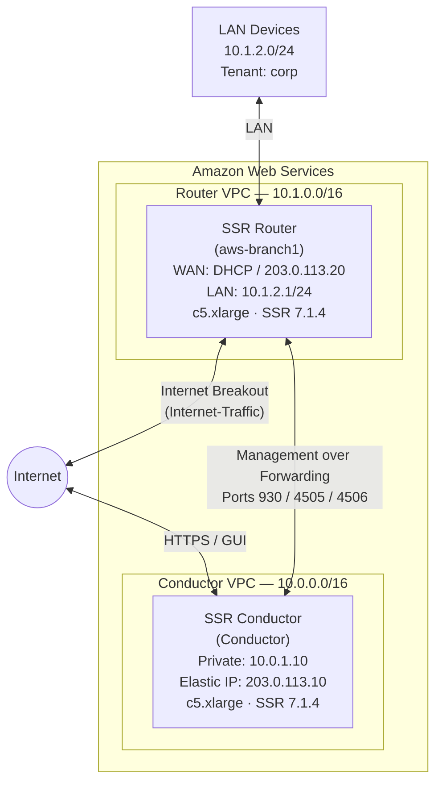

import NetworkDesign from './_deploy_aws_conductor_network_design.md';

This guide walks a network engineer through deploying a **BYOL Session Smart Conductor on AWS EC2** and connecting it to a managed SSR router. When you have completed the steps in this guide, the conductor EC2 instance will be running SSR 7.1.4, configured with an authority name, conductor address, and the shared services needed to bring a branch router online with internet breakout over the router's WAN forwarding interface.

## Guide Topics

| Step | Topic | Description |
|------|-------|-------------|
| 1 | [Launch the Conductor EC2 Instance](deploy_aws_conductor_instance.mdx) | Create the AWS EC2 instance that will host the conductor |
| 2 | [Install SSR 7.1.4 and Initialize the Conductor](deploy_aws_conductor_install.mdx) | Wait for BYOL installation and verify access to the conductor GUI |
| 3 | [Configure the Conductor](deploy_aws_conductor_config.mdx) | Set the authority name, conductor address, tenant, and internet service |
| 4 | [Launch the Router EC2 Instance](deploy_aws_router_instance.mdx) | Create the AWS EC2 instance for the managed router |
| 5 | [Configure the Router on the Conductor](deploy_aws_router_config.mdx) | Define router interfaces, management over forwarding, and internet service route |
| — | [Appendix — AWS Configuration](deploy_appendix_aws_conductor.mdx) | Complete PCLI configuration reference for conductor and router |

## Network Topology

## Roles

| Device | Type | Role |
|--------|------|------|
| `Conductor` | AWS EC2 (`c5.xlarge`) | Standalone SSR Conductor — centralized management and provisioning |
| `aws-branch1` | AWS EC2 (`c5.xlarge`) | Conductor-managed SSR router with internet breakout |

## Network Design Reference

<NetworkDesign/>

## Prerequisites

Before beginning, ensure the following are available:

- **AWS account** with permissions to launch EC2 instances, create VPCs and subnets, allocate Elastic IPs, and deploy CloudFormation stacks.
- **Juniper BYOL subscription** — access to the [Session Smart Networking Platform BYOL](https://aws.amazon.com/marketplace/pp/prodview-lz6cjd43qgw3c) offering in the AWS Marketplace. Accept the terms and conditions before deploying.
- **Artifactory credentials** — username and token for the Juniper software repository. These are required for BYOL software installation.

  :::note
  Contact your Juniper account team if you do not have Artifactory credentials.
  :::

- **IAM key pair** — an existing EC2 key pair in the target region for SSH access to both instances.
- **Networking** — a VPC and subnet for the conductor, and a separate VPC (or the same VPC with additional subnets) with at least two subnets for the router (WAN and LAN). The conductor subnet must be reachable from the router's WAN subnet on ports 930, 4505, and 4506.
- **Two Elastic IPs** allocated in your target region: one for the conductor and one for the router WAN interface.

:::note
BYOL instances require the conductor to run SSR 6.3.0-R1 or later. This guide targets SSR 7.1.4, which meets that requirement.
:::
