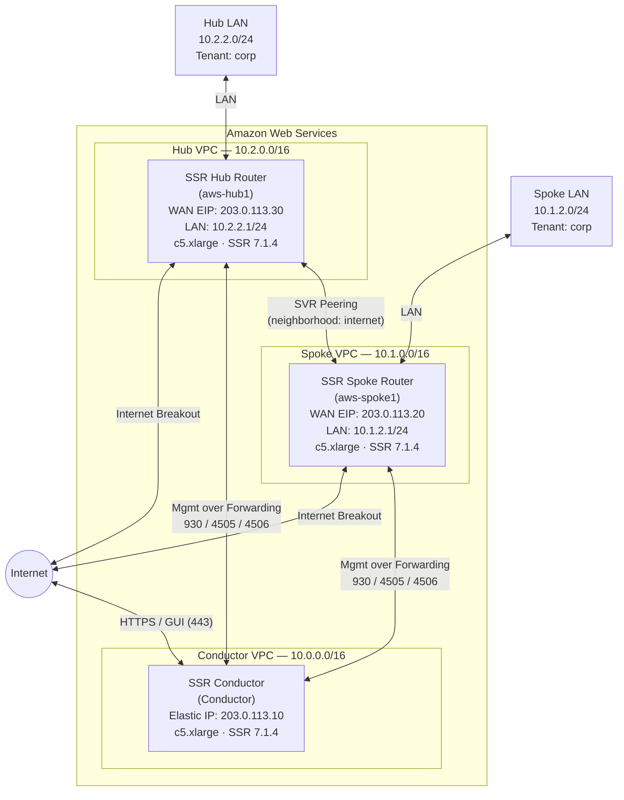

import NetworkDesign from './_deploy_aws_hub_spoke_network_design.md';

This guide walks a network engineer through deploying two conductor-managed SSR routers in AWS — a **hub** router that anchors the SVR network and a **spoke** router that peers with the hub — using the Juniper BYOL CloudFormation templates. By the end of the guide, both routers will be running SSR 7.1.4, managed by an existing SSR conductor, peered over SVR in the `internet` neighborhood, and forwarding internet traffic from their local LAN subnets with management returning to the conductor over each router's WAN forwarding interface.

:::note
This guide assumes a conductor is already installed and running SSR 7.1.4 with authority-level objects configured. If you have not yet deployed a conductor, complete the following guide first:

- [AWS Conductor Deployment Guide](deploy_aws_conductor.mdx)
:::

## Guide Topics

| Step | Topic | Description |
|------|-------|-------------|
| 1 | [Deploy the Hub Router Instance](deploy_aws_hub_router_instance.mdx) | Launch the AWS EC2 instance for the hub router |
| 2 | [Configure the Hub Router on the Conductor](deploy_aws_hub_router_config.mdx) | Create the hub router configuration with hub-topology SVR neighborhood and internet breakout |
| 3 | [Deploy the Spoke Router Instance](deploy_aws_spoke_router_instance.mdx) | Launch the AWS EC2 instance for the spoke router |
| 4 | [Configure the Spoke Router on the Conductor](deploy_aws_spoke_router_config.mdx) | Create the spoke router configuration and verify SVR peering with the hub |
| — | [Appendix — Hub and Spoke Configuration](deploy_appendix_aws_hub_spoke.mdx) | Complete PCLI configuration for both routers |

## Network Topology

## Roles

| Device | Type | Role |
|--------|------|------|
| `Conductor` | AWS EC2 (`c5.xlarge`) | Pre-existing conductor — centralized management and provisioning |
| `aws-hub1` | AWS EC2 (`c5.xlarge`) | Hub router — SVR network anchor, local internet breakout |
| `aws-spoke1` | AWS EC2 (`c5.xlarge`) | Spoke router — SVR peer of the hub, local internet breakout |

## Network Design Reference

<NetworkDesign/>

## Prerequisites

Before beginning, ensure the following are available:

- **Pre-existing conductor** — running SSR 7.1.4 with the following authority-level objects configured:
  - Authority name (for example, `Authority128`).
  - Conductor address set to the conductor Elastic IP (`203.0.113.10` in this guide).
  - `corp` tenant defined.
  - `Internet-Traffic` service defined with address `0.0.0.0/0` and access policy permitting `corp`.

  Complete the [AWS Conductor Deployment Guide](deploy_aws_conductor.mdx) before proceeding if any of these are missing.

- **AWS account** with permissions to launch EC2 instances, create VPCs and subnets, allocate Elastic IPs, and deploy CloudFormation stacks.
- **Juniper BYOL subscription** — access to the [Session Smart Networking Platform BYOL](https://aws.amazon.com/marketplace/pp/prodview-lz6cjd43qgw3c) offering in the AWS Marketplace. Accept the terms and conditions before deploying.
- **Artifactory credentials** — username and token for the Juniper software repository.
- **IAM key pair** — an existing EC2 key pair in the target region for SSH access.
- **Two Elastic IPs** allocated in your target region: one for the hub WAN interface (`203.0.113.30` in this guide) and one for the spoke WAN interface (`203.0.113.20` in this guide).
- **VPC and subnets for each router** — each router requires three subnets in its VPC: a management subnet (OOB SSH), a WAN subnet (public), and a LAN subnet (private). These can be in the same VPC or separate VPCs.

:::note
BYOL instances require the conductor to run SSR 6.3.0-R1 or later. This guide targets SSR 7.1.4, which meets that requirement.
:::

## Software Version Requirements

This guide targets **SSR 7.1.4** on both the hub and spoke routers.

:::note
The router software version cannot be higher than the conductor software version. Ensure the conductor is already running SSR 7.1.4 before deploying either router.
:::

## SVR Hub and Spoke Overview

Secure Vector Routing (SVR) hub-spoke topology is declared per neighborhood. Every router interface that participates in the `internet` neighborhood declares its role:

- **Hub** — anchors the neighborhood. The hub's external IP is distributed by the conductor to all spoke routers in the same neighborhood so they can initiate SVR sessions toward it.
- **Spoke** — peers with one or more hubs. SVR sessions originate from the spoke toward the hub's external IP.

The conductor automatically generates and distributes peer information based on the neighborhood topology — no manual peer stanzas are required in the GUI. Both routers must be committed to the same conductor for the conductor to generate the SVR peer relationship.

In this guide, both the hub and spoke perform **local internet breakout** — each router sends internet-bound traffic out its own WAN interface. SVR peering is established automatically after both router configurations are committed to the conductor.

## Related Documentation

- [AWS Conductor Deployment Guide](deploy_aws_conductor.mdx)
- [Management Traffic over Forwarding Interfaces](config_management_over_forwarding.md)
- [Conductor Deployment Best Practices](bcp_conductor_deployment.md)
