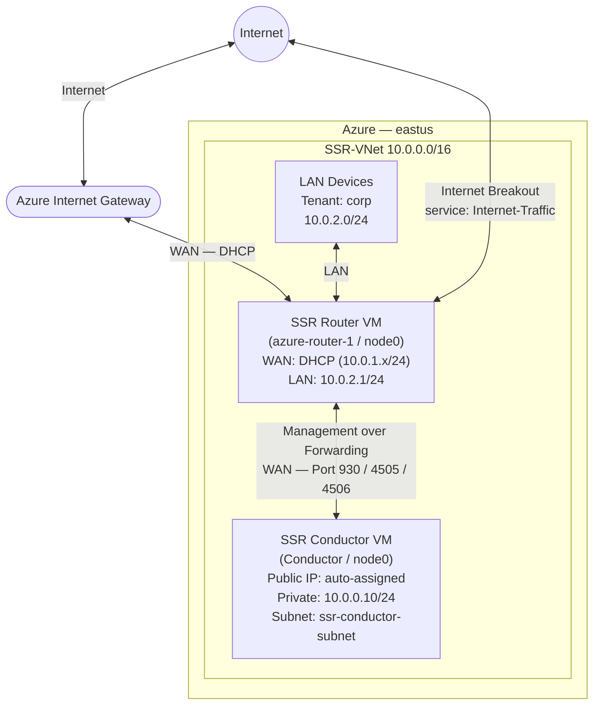

import NetworkDesign from './_deploy_azure_conductor_network_design.md';

This guide walks you through deploying a **Juniper Session Smart Conductor on Azure** using the Bring Your Own License (BYOL) plan, and then using that conductor to provision and manage a Session Smart Router (SSR) running in the same Azure VNet. When you complete this guide, the conductor VM will be running SSR 7.1.4, configured with an authority name, conductor address, and shared services that allow branch routers to onboard and begin forwarding traffic.

## Guide Topics

| Step | Topic | Description |
|------|-------|-------------|
| 1 | [Create the Azure Conductor VM](deploy_azure_conductor_vm.mdx) | Deploy the BYOL Conductor VM from the Azure Marketplace |
| 2 | [Initialize and Access the Conductor](deploy_azure_conductor_install.mdx) | Verify the BYOL installation and log in to the Conductor GUI |
| 3 | [Configure the Conductor](deploy_azure_conductor_config.mdx) | Set the authority name, conductor address, tenant, and internet service |
| 4 | [Deploy and Configure a Router](deploy_azure_conductor_router.mdx) | Deploy a BYOL conductor-managed router and configure WAN, LAN, and internet breakout |
| — | [Appendix — Conductor Configuration](deploy_appendix_azure_conductor.mdx) | Complete Azure conductor and router PCLI configuration reference |

## Network Topology

The diagram below shows the logical network this guide builds.

## Roles

| Device | Type | Role |
|--------|------|------|
| `Conductor` | Azure VM (BYOL) | Standalone SSR Conductor — centralized management and provisioning |
| `azure-router-1` | Azure VM (BYOL) | Conductor-managed SSR — internet breakout, LAN forwarding |

## Network Design Reference

<NetworkDesign/>

## Prerequisites

Before beginning, ensure the following are available:

- **Azure subscription** — with permission to create VMs, VNets, network security groups, and managed identities.
- **Azure VNet** — with at least the following subnets already created:
  - `ssr-conductor-subnet` — reachable via SSH and HTTPS for administration.
  - `ssr-router-wan` — the router's public (WAN) subnet; must have internet egress.
  - `ssr-router-lan` — the router's private (LAN) subnet.
- **Azure Managed Identity** — with the minimum read permissions listed in [Step 1](deploy_azure_conductor_vm.mdx#requirements).
- **Juniper software access credentials** — Artifactory username and password for SSR software downloads.
- **SSH key pair** — RSA 2048-bit or stronger; the public key is supplied to the Azure deployment templates.

## Software Version Requirements

This guide installs **SSR 7.1.4** on both the conductor and the router.

:::note
The router software version must be lower than or equal to the conductor software version.
:::

:::note
BYOL instances require the conductor to run SSR 6.3.0-R1 or newer. SSR 7.1.4 satisfies this requirement.
:::

## Related Documentation

- [System Requirements](intro_system_reqs)
- [Conductor Deployment Best Practices](bcp_conductor_deployment)
- [Management Traffic over Forwarding Interfaces](config_management_over_forwarding)
- [Onboard an SSR Device to a Conductor](onboard_ssr_to_conductor)
- [Installing a BYOL Conductor-managed Router in Azure](intro_installation_byol_azure_conductor)
- [Installing a PAYG Conductor-managed Router in Azure](intro_installation_azure)
