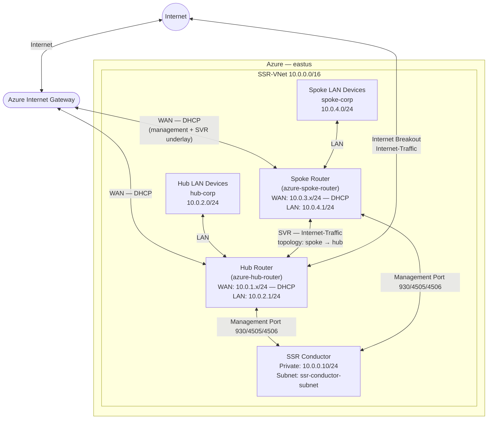

import NetworkDesign from './_deploy_azure_hub_spoke_network_design.md';

This guide walks you through deploying a **hub router and a spoke router on Azure** as conductor-managed SSR instances using the Bring Your Own License (BYOL) plan. When you complete this guide, both routers will be running SSR 7.1.4, connected to a pre-existing SSR conductor, and forwarding traffic with the following behavior:

- **Hub router** — provides direct internet breakout for hub LAN users and acts as the internet gateway for the spoke router over an SVR peer path.
- **Spoke router** — provides LAN services for spoke users and routes internet-bound traffic through the hub router via SVR.
- **Both routers** — reach the conductor using management over forwarding on their WAN interfaces.

:::note
This guide assumes a conductor is already installed and running SSR 7.1.4. If you have not yet deployed a conductor, complete the [Azure Conductor Deployment Guide](deploy_azure_conductor.mdx) first.
:::

## Guide Topics

| Step | Topic | Description |
|------|-------|-------------|
| 1 | [Create the Hub Router VM](deploy_azure_hub_spoke_hub_vm.mdx) | Deploy the BYOL Hub Router VM from the Azure Marketplace |
| 2 | [Create the Spoke Router VM](deploy_azure_hub_spoke_spoke_vm.mdx) | Deploy the BYOL Spoke Router VM from the Azure Marketplace |
| 3 | [Verify Installation and Discover VMBus UUIDs](deploy_azure_hub_spoke_vmbus.mdx) | Wait for SSR 7.1.4 installation to complete and identify NIC VMBus UUIDs for both routers |
| 4 | [Configure Hub and Spoke Routers](deploy_azure_hub_spoke_config.mdx) | Configure both routers on the conductor with WAN, LAN, and internet routing |
| — | [Appendix — Hub and Spoke Configuration](deploy_appendix_azure_hub_spoke.mdx) | Complete PCLI configuration reference for both routers |

## Network Topology

The diagram below shows the logical network this guide builds.

## Roles

| Device | Type | Role |
|--------|------|------|
| `Conductor` | Azure VM (BYOL) | Pre-existing conductor — centralized management and provisioning |
| `azure-hub-router` | Azure VM (BYOL) | Hub router — internet breakout for hub LAN and spoke SVR traffic |
| `azure-spoke-router` | Azure VM (BYOL) | Spoke router — LAN services, routes internet via hub SVR peer |

## Network Design Reference

<NetworkDesign/>

## Prerequisites

Before beginning, ensure the following are available:

- **Pre-existing SSR conductor** — running SSR 7.1.4 with a static public IP reachable from the hub and spoke WAN interfaces. This guide uses the conductor from the [Azure Conductor Deployment Guide](deploy_azure_conductor.mdx).
- **Azure subscription** — with permission to create VMs, VNets, network security groups, and managed identities.
- **Azure VNet** — `SSR-VNet` with at least the following subnets already created:
  - `ssr-hub-wan` — hub router WAN subnet; must have internet egress.
  - `ssr-hub-lan` — hub router LAN subnet.
  - `ssr-spoke-wan` — spoke router WAN subnet; must have internet egress.
  - `ssr-spoke-lan` — spoke router LAN subnet.
- **Two Azure Availability Sets** — one for the hub VM (`SSR-HubSet`) and one for the spoke VM (`SSR-SpokeSet`), in the same resource group.
- **Azure Managed Identity** — with the minimum read permissions listed in [Step 1](deploy_azure_hub_spoke_hub_vm.mdx#requirements).
- **Juniper software access credentials** — Artifactory username and token for SSR software downloads.
- **SSH key pair** — RSA 2048-bit or stronger; the public key is supplied to both deployment templates.

## Software Version Requirements

This guide installs **SSR 7.1.4** on both routers. The conductor must be running SSR 7.1.4 or newer before deploying the routers.

:::note
The router software version must be lower than or equal to the conductor software version.
:::

## Related Documentation

- [Azure Conductor Deployment Guide](deploy_azure_conductor.mdx)
- [Management Traffic over Forwarding Interfaces](config_management_over_forwarding.md)
- [Conductor Deployment Best Practices](bcp_conductor_deployment.md)
- [Onboard an SSR Device to a Conductor](onboard_ssr_to_conductor.md)
- [Installing a BYOL Conductor-managed Router in Azure](intro_installation_byol_azure_conductor.md)
- [System Requirements](intro_system_reqs.md)
