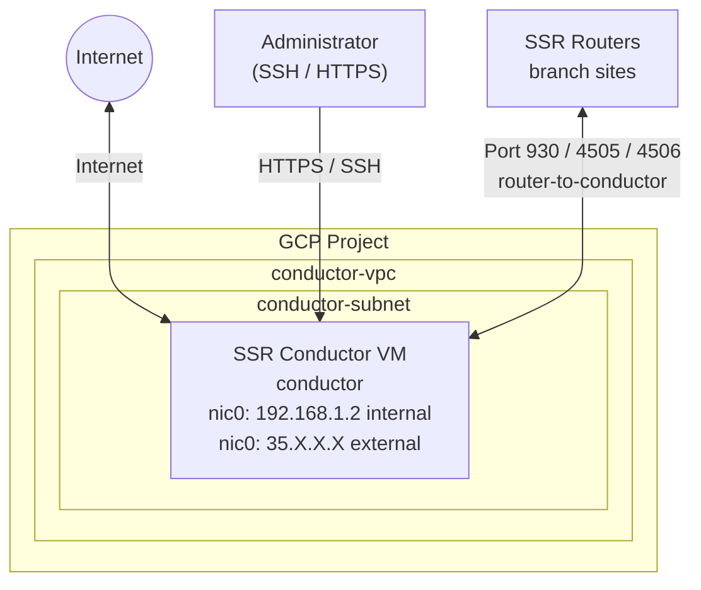

import NetworkDesign from './_deploy_gcp_conductor_network_design.md';

This guide walks a network engineer through deploying a **standalone SSR Conductor in Google Cloud Platform (GCP)** using the GCP Marketplace. You can choose between two deployment methods: a graphical user interface or a command-line (Terraform) workflow. When you complete the steps in this guide, the conductor will be running SSR 7.0.1, configured with an authority name and conductor address, and ready for SSR routers to onboard.

## Guide Topics

| Step | Topic | Description |
|------|-------|-------------|
| 1 | [Before You Deploy](deploy_gcp_conductor_prereqs.mdx) | Create the required VPC, subnet, and SSH key pair in GCP |
| 2 | [Deploy via GCP Marketplace](deploy_gcp_conductor_install.mdx) | Launch the conductor VM using the Marketplace GUI or CLI (Terraform) |
| 3 | [Configure the SSR Conductor](deploy_gcp_conductor_config.mdx) | Set the authority name, conductor address, and assign the asset ID |
| — | [Appendix — Deployment Parameters](deploy_appendix_gcp_conductor.mdx) | Complete Terraform variable reference for the GCP conductor deployment |

## Network Topology

The diagram below shows the logical network of the conductor in GCP deployed in this guide.

## Roles

| Device | Type | Role |
|--------|------|------|
| `conductor` | GCP VM (Marketplace) | Standalone SSR Conductor — centralized management and provisioning |

## Network Design Reference

<NetworkDesign/>

## Prerequisites

Before beginning, ensure the following are available:

- **GCP access** — access to a GCP project with permissions to create VPC networks, subnets, VM instances, and service accounts.
- **Juniper software access credentials** — Artifactory username and token for software downloads and provisioning.
- **SSH key pair** — an RSA key pair for authenticating to the conductor VM. Steps to create one are in [Step 1 — Before You Deploy](deploy_gcp_conductor_prereqs.mdx).

## Instance Size

Select a GCP machine type that meets your network scale requirements. The following instance types are supported for virtual SSR in GCP.

| GCP Machine Type | Max vNICs | vCPU Cores | Memory |
|------------------|-----------|-----------|--------|
| `c2-standard-4` | 4 | 4 | 16 GB |
| `c2-standard-8` | 8 | 8 | 32 GB |
| `c2-standard-16` | 10 | 16 | 64 GB |
| `c2-standard-30` | 10 | 30 | 120 GB |

For additional guidance, see [System Requirements](intro_system_reqs.md) and the [GCP machine type documentation](https://cloud.google.com/compute/docs/compute-optimized-machines#c2_machine_types).

## Software Version Requirements

This guide uses **SSR 7.0.1** on the conductor.

:::note
The router software version must be lower than or equal to the conductor software version.
:::

## Related Documentation

- [Installing a BYOL Conductor-managed Router in GCP](intro_installation_byol_gcp_conductor.md)
- [System Requirements](intro_system_reqs.md)
- [Conductor Deployment Best Practices](bcp_conductor_deployment.md)
- [Onboard an SSR Device to a Conductor](onboard_ssr_to_conductor.md)
