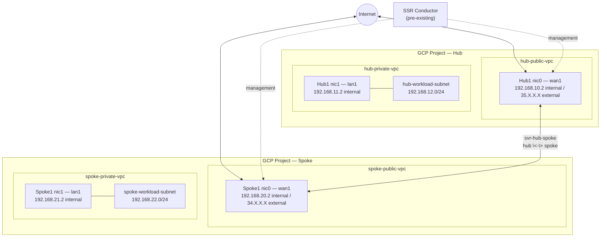

import NetworkDesign from './_deploy_gcp_hub_spoke_router_network_design.md';

This guide walks you through deploying **two conductor-managed SSR routers in Google Cloud Platform (GCP)** — a hub router (`Hub1`) and a spoke router (`Spoke1`) — using the GCP Marketplace. When you complete this guide, both routers will be running SSR 7.1.4, connected to a pre-existing SSR conductor, and forwarding traffic with the following behavior:

- **Hub router (`Hub1`)** — provides direct internet breakout for its own workloads and forms the hub side of the hub-spoke SVR adjacency.
- **Spoke router (`Spoke1`)** — provides LAN connectivity for its own workloads and reaches hub workloads over the hub-spoke SVR path.
- **Both routers** — reach the conductor over their WAN interfaces for management, and can reach each other's workloads and the internet through the hub.

:::note
This guide assumes a conductor is already installed and running SSR 7.1.4. If you have not yet deployed a conductor, complete one of the conductor deployment guides first:

- [GCP Conductor Deployment Guide](deploy_gcp_conductor.mdx)

This guide also builds on the router deployment inputs described in [Installing a BYOL Conductor-managed Router in GCP](intro_installation_byol_gcp_conductor.md). Refer to that page for the full BYOL Marketplace and Terraform deployment parameter reference.
:::

## Guide Topics

| Step | Topic | Description |
|------|-------|-------------|
| 1 | [Configure the GCP Prerequisites](deploy_gcp_hub_spoke_prereqs.mdx) | Create the required VPCs, SSH key pair, and GCP service account used for deployment. |
| 2 | [Deploy the Hub Router VM](deploy_gcp_hub_spoke_hub_vm.mdx) | Launch the `Hub1` router VM using the GCP Marketplace GUI or Terraform. |
| 3 | [Deploy the Spoke Router VM](deploy_gcp_hub_spoke_spoke_vm.mdx) | Launch the `Spoke1` router VM using the GCP Marketplace GUI or Terraform. |
| 4 | [Onboard the Routers to the Conductor](deploy_gcp_hub_spoke_onboard.mdx) | Create the router objects on the conductor and bind each to its GCP asset ID. |
| 5 | [Configure Hub and Spoke Routers](deploy_gcp_hub_spoke_config.mdx) | Configure WAN/LAN interfaces, tenants, services, the hub-spoke neighborhood, and service routes. |
| — | [Appendix — Hub and Spoke Configuration](deploy_appendix_gcp_hub_spoke.mdx) | Complete PCLI configuration reference for both routers. |

## Network Topology

The diagram below shows the logical network this guide builds.

## Roles

| Device | Type | Role |
|--------|------|------|
| `Conductor` | Pre-existing conductor | Centralized management and provisioning. |
| `Hub1` | GCP VM (Marketplace, vSSR) | Conductor-managed hub router — internet breakout for its own workloads and hub-spoke SVR adjacency. |
| `Spoke1` | GCP VM (Marketplace, vSSR) | Conductor-managed spoke router — LAN workload connectivity through the hub over SVR. |

## Network Design Reference

<NetworkDesign/>

## Prerequisites

Before beginning, ensure the following are available:

- **GCP access** — access to a GCP project with permissions to create VPC networks, subnets, VM instances, and service accounts.
- **Juniper software access credentials** — Artifactory username and token for software downloads and provisioning.
- **Pre-existing conductor** — running SSR 7.1.4 at a public or otherwise reachable control IP. This guide uses `35.Y.Y.Y`.
- **SSH key pair** — an RSA key pair for authenticating to each router VM. Steps to create one are in [Step 1](deploy_gcp_hub_spoke_prereqs.mdx#2-create-an-ssh-key-pair).
- **New or existing VPCs and subnets** for each router's WAN and LAN interfaces. Steps to create new VPCs are in [Step 1](deploy_gcp_hub_spoke_prereqs.mdx#1-create-the-hub-and-spoke-vpcs-and-subnets).

## Software Version Requirements

This guide targets **SSR 7.1.4** on both routers.

:::note
Router software version cannot be higher than the conductor software version. Ensure the conductor is already running SSR 7.1.4 before onboarding either router at that version.
:::

## Related Documentation

- [Installing a BYOL Conductor-managed Router in GCP](intro_installation_byol_gcp_conductor.md)
- [GCP Conductor Deployment Guide](deploy_gcp_conductor.mdx)
- [Management Traffic over Forwarding Interfaces](config_management_over_forwarding.md)
- [Conductor Deployment Best Practices](bcp_conductor_deployment.md)
- [System Requirements](intro_system_reqs.md)
