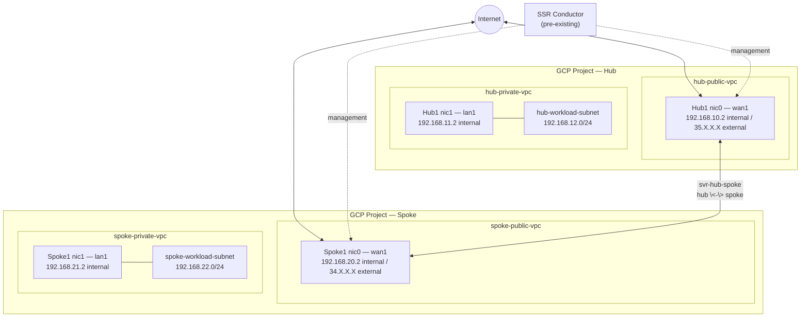

import NetworkDesign from './_deploy_gcp_hub_spoke_router_network_design.md';

This guide walks a network engineer through deploying **two conductor-managed SSR routers in Google Cloud Platform (GCP)** — a hub router (`Hub1`) and a spoke router (`Spoke1`) — using the GCP Marketplace. By the end of the guide, both routers will be running SSR 7.1.4, managed by an existing SSR conductor, and connected to each other over a direct SVR neighborhood so that workloads behind the hub and workloads behind the spoke can reach each other, reach the internet through the hub, and be reached by the conductor for management.

:::note
This guide assumes a conductor is already installed and running SSR 7.1.4. If you have not yet deployed a conductor, complete one of the conductor deployment guides first:

- [GCP Conductor Deployment Guide](deploy_gcp_conductor.mdx)

This guide also builds on the router deployment inputs described in [Installing a BYOL Conductor-managed Router in GCP](intro_installation_byol_gcp_conductor.md). Refer to that page for the full BYOL Marketplace and Terraform deployment parameter reference.
:::

## Guide Topics

| Step | Topic | Description |
|------|-------|-------------|
| 1 | [Configure the GCP Prerequisites](#step-1-configure-the-gcp-prerequisites) | Create the required VPCs, SSH public/private key pair, and the GCP service account used for deployment. |
| 2 | [Deploy the Hub Router VM](#step-2-deploy-the-hub-router-vm) | Launch the `Hub1` router VM using the GCP GUI or CLI (Terraform). |
| 3 | [Deploy the Spoke Router VM](#step-3-deploy-the-spoke-router-vm) | Launch the `Spoke1` router VM using the GCP GUI or CLI (Terraform). |
| 4 | [Onboard the Routers to the Conductor](#step-4-onboard-the-routers-to-the-conductor) | Create the router objects on the conductor and bind each to its GCP asset ID. |
| 5 | [Configure the Hub Router Interfaces](#step-5-configure-the-hub-router-interfaces) | Configure the `Hub1` WAN and LAN interfaces. |
| 6 | [Configure the Spoke Router Interfaces](#step-6-configure-the-spoke-router-interfaces) | Configure the `Spoke1` WAN and LAN interfaces. |
| 7 | [Configure Tenants, Services, and the Hub-Spoke Neighborhood](#step-7-configure-tenants-services-and-the-hub-spoke-neighborhood) | Define the workload tenants and services, and connect the hub and spoke over SVR. |
| 8 | [Configure Service Routes](#step-8-configure-service-routes) | Allow internet breakout and bidirectional traffic between the hub and spoke workloads. |

## Network Topology

The diagram below shows the logical network this guide builds.



## Roles

| Device | Type | Role |
|--------|------|------|
| `Conductor` | Pre-existing conductor | Centralized management and provisioning. |
| `Hub1` | GCP VM (Marketplace, vSSR) | Conductor-managed hub router — internet breakout for its own workloads and hub-spoke SVR adjacency. |
| `Spoke1` | GCP VM (Marketplace, vSSR) | Conductor-managed spoke router — LAN workload connectivity through the hub over SVR. |

## Network Design Reference

<NetworkDesign/>

## Prerequisites

Before beginning, ensure the following are available:

- **GCP access** — access to a GCP project with permissions to create VPC networks, subnets, VM instances, and service accounts.
- **Juniper software access credentials** — Artifactory username and token for software downloads and provisioning.
- **Pre-existing conductor** — running SSR 7.1.4 at a public or otherwise reachable control IP. This guide uses `35.Y.Y.Y`.
- **SSH key pair** — an RSA key pair for authenticating to each router VM. Steps to create one are in [Step 1](#2-create-an-ssh-key-pair).
- **New or existing VPCs and subnets** for each router's WAN and LAN interfaces. Steps to create new VPCs are in [Step 1](#1-create-the-hub-and-spoke-vpcs-and-subnets).

### Instance Size

Select a GCP machine type that meets your network scale requirements. The following instance types are supported for virtual SSR in GCP.

| GCP Machine Type | Max vNICs | vCPU Cores | Memory |
|------------------|-----------|-----------|--------|
| `c2-standard-4`  | 4  | 4  | 16 GB  |
| `c2-standard-8`  | 8  | 8  | 32 GB  |
| `c2-standard-16` | 10 | 16 | 64 GB  |
| `c2-standard-30` | 10 | 30 | 120 GB |

Session Smart Router size recommendations can be found in [System Requirements](intro_system_reqs.md).

### Software Version Requirements

This guide targets **SSR 7.1.4** on both routers.

:::note
Router software version cannot be higher than the conductor software version. Ensure the conductor is already running SSR 7.1.4 before onboarding either router at that version.
:::

## Step 1: Configure the GCP Prerequisites

### 1. Create the Hub and Spoke VPCs and Subnets

Each router requires its own WAN VPC/subnet and LAN VPC/subnet. Repeat this step four times — once each for `hub-public-vpc`, `hub-private-vpc`, `spoke-public-vpc`, and `spoke-private-vpc` — substituting the names and IPv4 ranges from the [Network Design Reference](#network-design-reference).

1. In the GCP console, search for **VPC networks** in the search bar and click on **VPC Networks**.

   

2. On the Google Cloud dashboard under VPC networks, click **Create VPC Network**.

   

3. Under **Create a VPC network**, enter the following information:
   - VPC Name — for example, `hub-public-vpc`
   - Subnet Name — for example, `hub-public-subnet`
   - Subnet Region
   - An IPv4 range for the subnet — for example, `192.168.10.0/24`

   

4. Scroll to the bottom and click **Create**.

   After the VPC is created it appears on the VPC networks page.

   

5. Repeat for the remaining three VPCs and subnets (`hub-private-vpc`, `spoke-public-vpc`, `spoke-private-vpc`).

:::note
Existing VPCs and subnets can be used instead of creating new ones. In that case, skip this step and use your existing VPC and subnet names during the Marketplace deployment.
:::

### 2. Create an SSH Key Pair

An SSH key pair authenticates you to each router VM after deployment. You can reuse the same key pair for both `Hub1` and `Spoke1`, or create a separate pair for each.

1. On your local machine, open a terminal and run:

   ```bash
   ssh-keygen -t rsa -b 4096
   ```

2. When prompted, enter a name for the key pair and a passphrase. The key files are saved to your home directory.

3. Display the public key, replacing `<your-key-pair-name>` with the filename you chose:

   ```bash
   cat <your-key-pair-name>.pub
   ```

4. Copy the output. You will paste this value into the **SSH Public Key** field during each router's Marketplace deployment.

### 3. Create the GCP Service Account

Each router deployment requires a GCP service account with the following IAM roles:

| Role | Purpose |
|------|---------|
| `roles/config.agent` | Required for GCP deployment manager operations. |
| `roles/compute.admin` | Required to create and manage compute resources. |
| `roles/iam.serviceAccountUser` | Required to act as the service account. |
| `roles/storage.objectViewer` | Required to read deployment objects from storage. |

You can create the service account directly within the Marketplace deployment form for each router — a separate pre-creation step in the GCP console is not required. You may use the same service account for both `Hub1` and `Spoke1`, or create one per router.

## Step 2: Deploy the Hub Router VM

This step deploys `Hub1` using either the GCP Marketplace graphical user interface or the command line (Terraform). You do not need to do both.

### Deploy via GCP Marketplace Graphical User Interface

1. In the GCP console, search for **Marketplace** in the search bar and click the top result.
2. Search for **Session Smart Networking Platform – BYOL** and click the matching listing.
3. On the product details page, click **Launch**.
4. Provide a **Deployment Name** — for example, `hub1`. This name is displayed in GCP and in the conductor UI.
5. In the **Deployment Service Account** section, select an existing account or create a new one as described in [Step 1](#3-create-the-gcp-service-account).
6. In the **Machine Type** section, select the instance size from [Instance Size](#instance-size) and the desired **Region** and **Zone**.
7. In the **Session Smart Router BYOL Configuration** section, select **conductor-managed** for **SSR Mode** and enter the desired **SSR Version** (`7.1.4`).
8. In the **SSH Access Control** section, enter the **Admin Allowed CIDR** for SSH/HTTPS access and paste the SSH public key created in [Step 1](#2-create-an-ssh-key-pair).
9. In the **SSR Mode: Conductor-Managed Router Configuration Options** section, click **Add item** to enter the conductor's control IP (`35.Y.Y.Y`), and enter your Artifactory username and token.
10. In the **SSR WAN Interfaces** section, enter the **WAN Allowed CIDR** (source IP range permitted for SVR traffic). Click **Add a new interface**, select `hub-public-vpc` under **Network** and `hub-public-subnet` under **Subnetwork**, then click **Done**.
11. In the **SSR LAN Interfaces** section, enter the **LAN Allowed CIDR** (source IP range of workloads permitted connectivity through the router). Click **Add a new interface**, select `hub-private-vpc` under **Network** and `hub-private-subnet` under **Subnetwork**, then click **Done**.
12. Scroll to the bottom and click **Deploy**.

   
   
   

GCP creates the `Hub1` VM in under 5 minutes — a green check mark appears next to **Status** for each created resource. After the VM is created, it automatically installs the SSR software and checks in to the conductor. Allow an additional 10 to 15 minutes for this process to complete before continuing to [Step 4](#step-4-onboard-the-routers-to-the-conductor).

### Deploy via GCP Marketplace Command Line (Terraform)

1. In the GCP console, search for **Marketplace** and open the **Session Smart Networking Platform – BYOL** listing.
2. Click **Launch**, then select the **Command-Line Deployment** tab.
3. Click **Download** to download the Terraform deployment package.

   

4. Unzip the downloaded package on your local machine. Within the resulting Terraform module folder, create a file named `ssr-variables.tfvars` with values similar to the following, substituting your own values:

   ```
   goog_cm_deployment_name = "hub1"
   machine_type            = "c2-standard-4"
   region                  = "us-west2"
   zone                    = "us-west2-a"
   boot_disk_size          = "60"
   ssr_mode                = "conductor-managed"
   ssr_version             = "7.1.4"
   artifactory_user        = "<input-your-artifactory-user>"
   artifactory_token       = "<input-your-artifactory-token>"
   conductor_control_ips   = ["35.Y.Y.Y"]
   ssh_public_key          = "<input-your-ssh-public-key>"
   admin_allowed_cidr      = "0.0.0.0/0"
   wan_nic_allowed_cidr    = "0.0.0.0/0"
   wan_nic_networks        = ["hub-public-vpc"]
   wan_nic_subnets         = ["hub-public-subnet"]
   lan_nic_allowed_cidr    = "0.0.0.0/0"
   lan_nic_networks        = ["hub-private-vpc"]
   lan_nic_subnets         = ["hub-private-subnet"]
   ```

5. Use the GCP Cloud Shell to run the deployment. Click the **Activate Cloud Shell** icon at the top right of the GCP console, then upload your Terraform module folder using the Cloud Shell Terminal's **Upload** option.
6. Navigate to the uploaded folder and initialize Terraform:

   ```bash
   cd <your-terraform-module-folder-name>
   terraform init
   ```

7. Apply the deployment:

   ```bash
   terraform apply --var-file=ssr-variables.tfvars
   ```

8. Follow the prompts to confirm your project name and the deployment actions. When complete, Terraform prints `Apply complete` along with `ssh_username`, `ssr_instance_id`, and `ssr_public_ip_addresses`.

After the VM is created, it automatically installs the SSR software. Allow an additional 10 to 15 minutes for this process to complete before continuing to [Step 4](#step-4-onboard-the-routers-to-the-conductor).

For the full BYOL Terraform variable reference, see [Installing a BYOL Conductor-managed Router in GCP](intro_installation_byol_gcp_conductor.md#deployment-parameters-conductor-managed-router).

## Step 3: Deploy the Spoke Router VM

Repeat [Step 2](#step-2-deploy-the-hub-router-vm) — using either the GUI or Terraform method — to deploy `Spoke1`, substituting the Spoke1 values from the [Network Design Reference](#network-design-reference):

| Field | Hub1 Value | Spoke1 Value |
|-------|-----------|--------------|
| Deployment Name | `hub1` | `spoke1` |
| WAN Network / Subnetwork | `hub-public-vpc` / `hub-public-subnet` | `spoke-public-vpc` / `spoke-public-subnet` |
| LAN Network / Subnetwork | `hub-private-vpc` / `hub-private-subnet` | `spoke-private-vpc` / `spoke-private-subnet` |
| `goog_cm_deployment_name` | `hub1` | `spoke1` |
| `wan_nic_networks` / `wan_nic_subnets` | `["hub-public-vpc"]` / `["hub-public-subnet"]` | `["spoke-public-vpc"]` / `["spoke-public-subnet"]` |
| `lan_nic_networks` / `lan_nic_subnets` | `["hub-private-vpc"]` / `["hub-private-subnet"]` | `["spoke-private-vpc"]` / `["spoke-private-subnet"]` |

All other fields — conductor control IP, Artifactory credentials, SSH public key, and SSR mode/version — are the same for both routers.

## Step 4: Onboard the Routers to the Conductor

Perform this step for `Hub1`, then repeat for `Spoke1`.

1. Open a browser tab and navigate to your conductor: `https://<conductor-external-IP>` and log in to the conductor GUI.
2. On the left menu, click **Authority** under **Configuration**, and click **Add** next to the **Routers** section.

   

3. In the **New Router** pop-up window, enter the router name (`hub1` or `spoke1`) and click **Save**.

   

4. In the **Basic Information** section, select `internal` for the **Inter-node Security Policy** field.

   

5. Below **Basic Info**, click **Add** next to **Nodes**. In the **New Node** pop-up window, enter `node0` and click **Save**.

   

6. On the **Node** screen, set the **Associated Asset ID** to the router's GCP deployment name (`hub1` or `spoke1`) and set **Role** to `combo`.

   

7. Click **Validate and Commit**. If a review-commit warning appears, click **Proceed** and **Commit**.

The router VM begins to synchronize with the conductor. Navigate to **Routers** under **Authority** and wait for the **Provisioner** status to show `Synchronized` before continuing. This may take 8–10 minutes per router.

## Step 5: Configure the Hub Router Interfaces

With `Hub1` synchronized, configure its WAN and LAN interfaces from the conductor GUI. From **Authority**, click on `hub1`, then click `node0`.

### Configure the Hub WAN Interface

1. In the **Device Interfaces** section, click **Add**. Enter the name `wan-dev` and click **Save**.
2. In the **Device Interface Type Settings** section, select `PCI Address` for **Identifier** and select `0000:00:04.0` for **PCI Address**.
3. In the **Network Interfaces** section, click **Add**. Enter the name `wan1` and click **Save**.
4. In the **Basic Information** section, select `internal` for **Security Policy** and `v4` for **DHCP**.
5. In the **Management Traffic Settings** section, toggle `true` under **Conductor**, toggle `true` under **Management Enabled**, enter a **Management Vector Name**, enter `100` for **Management Vector Priority**, and toggle `true` under **Default Route**.
6. In the **Host Services** section, click **Add**, select `ssh` for **Service Type**, and click **Save**. This allows SSH over the WAN interface.
7. In the **Access Policies** section, click **Add**, enter an IP prefix permitted for SSH access in the **Source** field, and click **Save**.
8. Navigate back to the network interface configuration page and, in the **Network Interface Settings** section, toggle `true` under **Source NAT**.
9. Click **Validate and Commit**, then **Proceed Commit**.

Wait until the **Provisioner** status returns to `Synchronized` under **Routers**.

### Configure the Hub LAN Interface

1. Return to `hub1` → `node0`. In the **Device Interfaces** section, click **Add**. Enter the name `lan-dev` and click **Save**.
2. In the **Device Interface Type Settings** section, select `PCI Address` for **Identifier** and select `0000:00:05.0` for **PCI Address**.
3. In the **Network Interfaces** section, click **Add**. Enter the name `lan1` and click **Save**.
4. In the **Basic Information** section, select `internal` for **Security Policy**.
5. In the **Interface Addresses** section, click **Add**. Enter the LAN interface IP address GCP assigned to `nic1` (`192.168.11.2`) in the **Address** field, and click **Save**.

   :::tip
   To find the assigned IP address, open the GCP console, search **VM instances**, locate the `hub1` VM, and copy the internal IP for `nic1`.
   :::

6. Still in **Basic Information**, enter the LAN interface's prefix length (`24`) in the **Prefix** field, and the GCP subnet gateway (typically the `.1` address of the subnet, `192.168.11.1`) in the **Gateway** field.
7. Click **Validate and Commit**, then **Proceed Commit**.

The `Hub1` LAN interface is now configured.

## Step 6: Configure the Spoke Router Interfaces

Repeat [Step 5](#step-5-configure-the-hub-router-interfaces) for `spoke1`, substituting the Spoke1 values from the [Network Design Reference](#network-design-reference):

| Setting | Hub1 Value | Spoke1 Value |
|---------|-----------|--------------|
| Router | `hub1` | `spoke1` |
| WAN LAN interface IP | `192.168.11.2` | `192.168.21.2` |
| LAN gateway | `192.168.11.1` | `192.168.21.1` |

WAN and LAN device interface PCI addresses (`0000:00:04.0` and `0000:00:05.0`) and interface names (`wan-dev`/`wan1`, `lan-dev`/`lan1`) are the same on both routers, since each is a separate two-NIC GCP VM.

## Step 7: Configure Tenants, Services, and the Hub-Spoke Neighborhood

To allow traffic between hub workloads, spoke workloads, and the internet, configure tenants, services, and a shared neighborhood, then reference them in service routes in [Step 8](#step-8-configure-service-routes).

### Create Tenants

Create one tenant per router, using **tenancy by subnets** so that tenant members are defined as subnets within a neighborhood assigned to that router's LAN interface.

1. Navigate to **Authority** under **Configuration**. In the **Tenants** section, click **Add**.
2. Enter the tenant name — `hub-workloads` for Hub1, `spoke-workloads` for Spoke1 — and click **Save**.
3. In the **Tenant Members** section, click **Add**. Enter a name for the tenant members neighborhood and click **Save**.
4. In the **Tenant Subnets** section, click **Add** for each workload subnet behind that router (for example, `hub-workload-subnet` / `192.168.12.0/24`). Repeat if you have multiple workload subnets.
5. Click **Validate and Commit**, then **Proceed Commit**.
6. Assign the tenant member neighborhood to that router's LAN interface: navigate to the router → `node0` → the LAN device interface → LAN network interface → **Neighborhoods** → **Add**, select the neighborhood, and click **Save**. Commit the change.

Repeat this procedure for the other router. `hub-workloads` members are assigned to `hub1`'s `lan1`; `spoke-workloads` members are assigned to `spoke1`'s `lan1`.

### Create Services

Create one service per router's workloads, plus modify the default internet service.

1. Navigate to **Authority** under **Configuration**. In the **Services** section, click **Add**.
2. Enter the service name — `Hub-Workloads` for Hub1's workloads, `Spoke-Workloads` for Spoke1's workloads — and click **Save**.
3. In the **Service Addresses** section, click **Add** for each workload subnet the service represents (for example, `192.168.12.0/24`).
4. In the **Policies** section, select `internal` for **Security Policy**.
5. In the **Access Policies** section, click **Add**, and select the *other* router's tenant as the permitted **Source** — for example, the `Hub-Workloads` service permits the `spoke-workloads` tenant, and the `Spoke-Workloads` service permits the `hub-workloads` tenant.
6. Click **Validate and Commit**, then **Proceed Commit**.

For internet access, modify the default internet service instead of creating a new one:

1. Navigate to **Authority** under **Configuration**. In the **Services** section, click the default `Internet-Traffic` service.
2. In the **Access Policies** section, click **Add**, select the `hub-workloads` tenant as the permitted **Source**, and click **Save**. Add the `spoke-workloads` tenant as well if spoke workloads also need direct internet breakout through the hub.
3. Click **Validate and Commit**, then **Proceed Commit**.

### Create the Hub-Spoke Neighborhood

For `Hub1` and `Spoke1` to establish SVR adjacency with each other, assign a shared neighborhood to both routers' WAN interfaces, with `Hub1` set as the hub and `Spoke1` set as the spoke.

1. Navigate to **Authority** under **Configuration**. In the **Routers** section, click on `hub1`.
2. In the **Nodes** section, select `node0`. In the **Device Interfaces** section, select the WAN device interface. In the **Network Interfaces** section, select the WAN network interface (`wan1`).
3. In the **Neighborhoods** section, click **Add**. Enter the neighborhood name `svr-hub-spoke` and click **Save**.
4. In the **Basic Information** section, select `hub` for the **Topology** field.
5. Click **Validate and Commit**, then **Proceed Commit**.
6. Repeat these steps on `spoke1`'s WAN network interface (`wan1`), using the same neighborhood name `svr-hub-spoke`, but select `spoke` for the **Topology** field.

Once committed on both routers, `Hub1` and `Spoke1` establish SVR adjacency over their WAN interfaces' external (public) IP addresses.

## Step 8: Configure Service Routes

With tenants, services, and the neighborhood in place, configure service routes so traffic flows in the desired directions. Each route below only shows the configuration on one router — apply the paired route on the other router as noted.

### Internet-destined Traffic (from Hub Workloads)

To allow `hub-workloads` to reach the internet through `Hub1`:

1. Navigate to **Authority** under **Configuration**. In the **Routers** section, click `hub1`.
2. In the **Service Routes** section, click **Add**. Enter a name (for example, `internet-route`) and click **Save**.
3. In the **Service Route Information** section, select `Internet-Traffic` for **Service Name**.
4. In the **Service Route Type** section, select `Service Agent` for **Type**.
5. In the **Next Hops** section, click **Add**, select `node0` for **Node** and `wan1` for **Network Interface**, and click **Save**.
6. Click **Validate and Commit**, then **Proceed Commit**.

:::note
You must also create a default or specific route in the `hub-private-vpc` (or the workload's own VPC, if peered) in GCP, with `Hub1`'s LAN interface IP (`192.168.11.2`) as the next hop, to force internet-destined workload traffic through the router.
:::

### Hub-to-Spoke Traffic

To allow `hub-workloads` to initiate traffic to `spoke-workloads`:

1. On `hub1`, in the **Service Routes** section, click **Add**. Enter a name (for example, `hub-to-spoke-route`) and click **Save**.
2. In the **Service Route Information** section, select `Spoke-Workloads` for **Service Name**.
3. In the **Service Route Type** section, select `Peer Service Route` for **Type**, and select `spoke1` for **Peer**.
4. Click **Validate and Commit**, then **Proceed Commit**.
5. On `spoke1`, create the paired inbound route: **Service Routes** → **Add** → name (for example, `hub-inbound-route`) → **Service Name** `Hub-Workloads` → **Type** `Service Agent` → **Next Hops** → `node0` / `lan1` → **Save** → **Validate and Commit** → **Proceed Commit**.

### Spoke-to-Hub Traffic

To allow `spoke-workloads` to initiate traffic to `hub-workloads`:

1. On `spoke1`, in the **Service Routes** section, click **Add**. Enter a name (for example, `spoke-to-hub-route`) and click **Save**.
2. In the **Service Route Information** section, select `Hub-Workloads` for **Service Name**.
3. In the **Service Route Type** section, select `Peer Service Route` for **Type**, and select `hub1` for **Peer**.
4. Click **Validate and Commit**, then **Proceed Commit**.
5. On `hub1`, create the paired inbound route: **Service Routes** → **Add** → name (for example, `spoke-inbound-route`) → **Service Name** `Spoke-Workloads` → **Type** `Service Agent` → **Next Hops** → `node0` / `lan1` → **Save** → **Validate and Commit** → **Proceed Commit**.

## Configuration Summary

After committing all steps, the conductor pushes the following configuration to `Hub1` and `Spoke1`.

| Object | Hub1 | Spoke1 |
|--------|------|--------|
| Router | `hub1`, combo node, asset-id `hub1` | `spoke1`, combo node, asset-id `spoke1` |
| WAN Interface | `wan1` — DHCP, conductor, default-route, source-nat, management | `wan1` — DHCP, conductor, default-route, source-nat, management |
| LAN Interface | `lan1` — `192.168.11.2/24` | `lan1` — `192.168.21.2/24` |
| Tenant | `hub-workloads` | `spoke-workloads` |
| Service | `Hub-Workloads` | `Spoke-Workloads` |
| Neighborhood | `svr-hub-spoke` — Topology `hub` | `svr-hub-spoke` — Topology `spoke` |
| Service Routes | `internet-route`, `hub-to-spoke-route`, `spoke-inbound-route` | `spoke-to-hub-route`, `hub-inbound-route` |

## Next Steps

At this point `Hub1` and `Spoke1` are online, connected to the conductor, adjacent to each other over SVR, and ready to forward traffic between their workloads and to the internet. Verify connectivity from a workload behind each router before moving workloads into production.

## Related Documentation

- [Installing a BYOL Conductor-managed Router in GCP](intro_installation_byol_gcp_conductor.md)
- [GCP Conductor Deployment Guide](deploy_gcp_conductor.mdx)
- [Management Traffic over Forwarding Interfaces](config_management_over_forwarding.md)
- [Conductor Deployment Best Practices](bcp_conductor_deployment.md)
