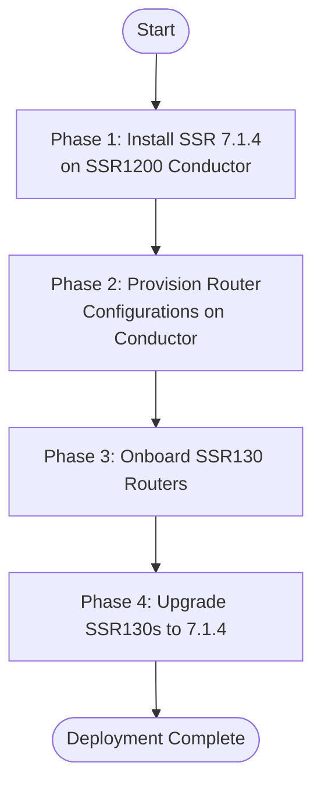

import Prerequisites from './_install_prereqs.md';
import ConductorInit from './_deploy_univ_conductor_init.md';
import ChangeDefaultPasswords from './_change_def_passwords.md';
import ConfigureToken from './_configure_token.md';
import ConductorAuthority from './_conductor_to_authority.md';
import AuthorityName from './_set_authority_name.md';
import SetConductorIP from './_set_conductor_ip.md';
import VerifyConductorInstall from './_install_verify_conductor_install.md';
import NextStepsConfig from './_conductor_install_nextsteps.md';
import SSR130PortCnx from './_hdwr_ssr130portcnx.md';
import RouterConfig from './_deploy_ssr130_router_config.md';
import RouterInit from './_deploy_univ_router_init.md';
import WanClaimMethods from './_wan_qs_claim_methods.md';

This guide walks through a complete end-to-end deployment of a conductor-managed SSR network: starting with a fresh SSR 7.1.4 installation on an SSR1200 acting as the Conductor, through onboarding and upgrading SSR130 branch routers.

## Deployment Overview



### What You Will Build

| Component | Hardware | Role | Software |
|-----------|----------|------|---------|
| Conductor | SSR1200  | Central management, provisioning, and policy | SSR 7.1.4 (installed fresh) |
| Branch Router(s) | SSR130 | WAN edge routing at each site | SSR 7.1.4 (upgraded post-onboarding) |

:::important
The Conductor **must** be installed and fully configured before onboarding any routers. Routers that attempt to contact a conductor without a pre-provisioned configuration for them will not onboard successfully.
:::

---

## Requirements

### Hardware

| Item | Quantity | Notes |
|------|----------|-------|
| Juniper SSR1200 | 1 | Acts as the standalone Conductor |
| Juniper SSR130 | 1 per branch site | Branch routers managed by the Conductor |
| Laptop / workstation | 1 | For USB creation, console access, and web-based initialization |
| RJ-45 rollover / console cable | 1 | For initial serial console access during ISO install |
| USB drive (≥ 8 GB) | 1 | For the bootable SSR ISO |
| Ethernet cables | As needed | For management, WAN, and LAN connections |

### Software

- SSR 7.1.4 Universal ISO (`SSR-7.1.4-*.ibu-v1.iso`) — downloaded from the [Juniper software portal](https://software.128technology.com/artifactory/list/generic-128t-install-images-release-local/)
- [Balena Etcher](https://www.balena.io/etcher/) or equivalent USB imaging tool
- Juniper support portal credentials (Artifactory username and token) for software downloads

### Network

| Interface | SSR1200 Port | Purpose |
|-----------|-------------|---------|
| Management | MGMT (`mgmt-0-0`) | Out-of-band conductor management (post-init) |
| Console | CONSOLE (RJ45) | Serial console used during ISO installation |
| Initialization LAN | Port 0/3 (`ge-0-3`) | Temporary laptop connection for web-based initialization |
| WAN | Port 0/0 (`ge-0-0`) | Optional: if the conductor requires internet access over a WAN port |

---

## Phase 1: Install SSR 7.1.4 on the SSR1200 Conductor

### Step 1.1 — Prerequisites

<Prerequisites/>

### Step 1.2 — Connect the SSR1200

Before powering on the SSR1200 for installation:

1. Connect a rollover cable from your laptop's serial adapter to the SSR1200 **CONSOLE** port.
2. Open a terminal emulator (for example, PuTTY or `screen`) at **115200 baud, 8N1**.
3. Connect the SSR1200 **MGMT** port to your management network (or leave it unconnected until after initialization).

:::note
The web-based initialization wizard (used in Step 1.5) requires a temporary direct Ethernet connection from your laptop to the SSR1200's LAN port. The MGMT port becomes the primary management interface only after initialization assigns it a static IP.
:::

### Step 1.3 — Download the SSR 7.1.4 ISO

1. Navigate to [https://software.128technology.com/artifactory/list/generic-128t-install-images-release-local/](https://software.128technology.com/artifactory/list/generic-128t-install-images-release-local/) using your browser.
2. Enter your Juniper software portal username and token when prompted.
3. Locate and download `SSR-7.1.4-<build>.ibu-v1.iso`.

:::note
Use the image-based ISO (`SSR-*.ibu-v1.iso`), not the legacy package-based ISO (`128T-*.iso`). The image-based ISO supports the web-based initialization workflow used in this guide.
:::

### Step 1.4 — Create a Bootable USB

Using [Balena Etcher](https://www.balena.io/etcher/):

1. Launch Etcher and select the downloaded SSR 7.1.4 `.iso` file as the source.
2. Select your USB drive as the target.
3. Click **Flash!** and wait for the process to complete.
4. Eject the USB drive once Etcher confirms the flash was successful.

For full instructions, see [Creating a Bootable USB](intro_creating_bootable_usb.md).

### Step 1.5 — Install SSR from USB

1. Insert the bootable USB drive into the SSR1200.
2. Power on the SSR1200.
3. When prompted on the console (`Press ESC for boot menu`), press **ESC**.
4. From the boot menu, select the USB drive as the boot device.
5. At the image selection screen, select the SSR 7.1.4 image and press **Enter**.

   

6. Select **Serial** or **VGA** console to match your connection.

   

7. At the install options screen, press **Enter** to begin a standard (non-FIPS) physical device installation.

   

8. Wait for the installation to complete (approximately 15–20 minutes). When prompted, allow the system to reboot.

   

9. Remove the USB drive after the reboot prompt, before the system restarts.

For full installation reference, see [SSR Installation](install_univ_iso.md).

### Step 1.6 — Initialize the Conductor

<ConductorInit/>

### Step 1.7 — Verify the Installation

<VerifyConductorInstall/>

### Step 1.8 — Change the Default Passwords

<ChangeDefaultPasswords/>

### Step 1.9 — Configure the Software Access Token

<ConfigureToken/>

:::note
If you entered your Artifactory credentials during the web initialization step (Step 1.6), the token is already configured and this step is not required. Proceed to [Step 1.10](#step-110--add-the-conductor-to-the-authority).
:::

### Step 1.10 — Add the Conductor to the Authority

<ConductorAuthority/>

### Step 1.11 — Set the Authority Name

<AuthorityName/>

### Step 1.12 — Set the Conductor IP Address

<SetConductorIP/>

---

## Phase 2: Provision Router Configurations on the Conductor

Before powering on any SSR130 routers, you must create a router configuration on the conductor for each device. The conductor uses the **router name** and **Asset ID** to recognize and associate each router when it connects.

<RouterConfig/>

:::note
<NextStepsConfig/>
:::

---

## Phase 3: Onboard SSR130 Routers

Each SSR130 router can be onboarded using one of two methods. Choose the method that best fits your deployment:

| Method | Best for | Notes |
|--------|----------|-------|
| **A: Universal ISO (fresh install)** | New hardware or re-imaging existing devices | Requires physical access and a USB drive per site |
| **B: Mist ZTP redirect** | SSR130 devices shipped from factory with SSR software pre-installed | Requires a Mist organization/site with the conductor IP configured |

:::tip
Method B (Mist ZTP) allows hands-off deployment at remote sites — the SSR130 automatically contacts Mist on first boot, receives the conductor IP, and self-onboards with no on-site technician interaction beyond physical cabling.
:::

---

### Method A: Install SSR 7.1.4 via Universal ISO

Use this method when installing from scratch or re-imaging the SSR130.

#### A.1 — Connect the SSR130

<SSR130PortCnx/>

:::note
When using Method A (fresh ISO install), you will connect to Port 3 (`ge-0-3`) with a laptop for the web initialization step. The WAN connection on Port 0 is used after initialization during normal operation — it is not required during the installation phase.
:::

#### A.2 — Install SSR from USB

Using the same bootable USB created in [Step 1.4](#step-14--create-a-bootable-usb) (or a new USB with the same SSR 7.1.4 ISO):

1. Insert the bootable USB into the SSR130.
2. Power on the SSR130.
3. When prompted (`Press ESC for boot menu`), press **ESC** and select the USB drive.
4. Select the SSR 7.1.4 image, choose Serial or VGA console as appropriate, and press **Enter** to begin installation.
5. Wait for the installation to complete and for the system to reboot.
6. Remove the USB drive before the system restarts.

#### A.3 — Initialize the SSR130 as a Conductor-Managed Router

<RouterInit/>

---

### Method B: Onboard via Mist ZTP Redirect

Use this method when the SSR130 ships from Juniper with SSR software pre-installed and the device will use Juniper Mist for Zero Touch Provisioning (ZTP) redirect to the conductor.

:::important
The Mist ZTP redirect process for conductor-managed deployments is supported on SSR100 and SSR1000 series devices, including the SSR130.
:::

#### B.1 — Configure a Mist Organization and Site

1. Log in to your [Mist organization dashboard](https://manage.mist.com/).
2. From the left menu, select **Organization → Settings**. Create an organization if one does not already exist.
3. From the left menu, select **Organization → Site Configuration** and click **Create Site**.
4. In the **New Site** panel, configure the site name and settings.
5. **Add the Conductor IP address** to the site configuration under **Session Smart Conductor Address**. This is the management IP address configured on the SSR1200 conductor in [Step 1.6](#step-16--initialize-the-conductor).

   

6. Save the site configuration.

#### B.2 — Claim the SSR130 in Mist

<WanClaimMethods/>

#### B.3 — Connect and Power On the SSR130

<SSR130PortCnx/>

When the SSR130 powers on:
- It connects to Mist on its WAN port via DHCP.
- Mist redirects it to the conductor IP address configured in the site.
- The conductor uses the device's Asset ID to match it to the pre-provisioned router configuration.
- The router downloads its configuration and moves to **Running** state.

#### B.4 — Verify Onboarding

From the Conductor GUI:

1. Navigate to **Routers** in the left-side navigation.
2. Locate the router by name. Confirm that the status shows **Running**.

From the conductor PCLI:

```
admin@node1.corp-conductor# show assets
```

A successfully onboarded router appears in the asset list with a **Running** state and the correct software version.

---

## Phase 4: Upgrade SSR130 Routers to SSR 7.1.4

Once the SSR130 routers are onboarded and in a **Running** state, upgrade them to SSR 7.1.4 from the conductor.

:::note
The router software version cannot exceed the conductor software version. Since the conductor is already running 7.1.4 (installed in Phase 1), upgrading the routers to 7.1.4 is fully supported.
:::

### Upgrade Using the Conductor GUI

1. From the Conductor GUI, navigate to **Routers**.
2. At the top of the Routers page, select **Software Lifecycle**.
3. Select **Initiate Upgrade**.
4. Select **Download**, then choose **SSR 7.1.4** from the version dropdown.
5. Select the router or routers to upgrade, then click **Start** to begin the download.
6. Once the download is complete, return to **Software Lifecycle**, select **Upgrade**, choose version `7.1.4`, select the routers, and click **Start**.

The upgrade runs to completion without further interaction. Track progress under **Lifecycle History**.

### Upgrade Using the Conductor PCLI

As an alternative to the GUI, you can upgrade routers from the PCLI:

```
# List all managed assets and their current software versions
admin@node1.corp-conductor# show assets

# Download SSR 7.1.4 to a specific router
admin@node1.corp-conductor# request system software download router <router-name> node <node-name> version 7.1.4

# Monitor the download
admin@node1.corp-conductor# show system software download router <router-name> node <node-name>

# Once the download is complete, initiate the upgrade
admin@node1.corp-conductor# request system software upgrade router <router-name> node <node-name> version 7.1.4

# Monitor the upgrade
admin@node1.corp-conductor# show system software upgrade router <router-name> node <node-name>
```

:::note
To upgrade all nodes in an HA router at the same time, omit the `node` parameter:
```
request system software download router <router-name> version 7.1.4
```
The conductor upgrades each node sequentially to minimize traffic disruption.
:::

### Verify the Upgrade

After the upgrade completes, verify each router is running SSR 7.1.4:

```
admin@node1.corp-conductor# show assets
```

Each router should report version `7.1.4` and a **Running** state.

---

## Verify the Complete Deployment

After all phases are complete, perform the following checks to confirm the deployment is operating correctly.

### From the Conductor GUI

1. Navigate to **Routers**. All routers should show a status of **Running**.
2. Navigate to **Conductor → Node** panel and confirm the conductor status is **Running**.
3. Navigate to **Authority → Conductor Addresses** and confirm the correct public conductor IP is listed.

### From the Conductor PCLI

```
# Confirm all managed routers are connected and synced
admin@node1.corp-conductor# show system connectivity

# Check the software version on all assets
admin@node1.corp-conductor# show assets

# Confirm routing is active on a specific router
admin@node1.corp-conductor# show rib router <router-name>

# Verify sessions are being processed
admin@node1.corp-conductor# show sessions router <router-name>
```

### Expected Outcomes

| Check | Expected Result |
|-------|-----------------|
| Conductor status | Running, version 7.1.4 |
| Router status (each SSR130) | Running, version 7.1.4, Connected |
| Authority → Conductor Addresses | Correct conductor management IP present |
| `show system connectivity` | All routers show `Connected` |

---

## Next Steps

With your conductor-managed network deployed and all routers upgraded to SSR 7.1.4, consider the following:

- **Refine router configurations**: Review and expand the basic router configurations created in Phase 2. See [Configuration Management on the SSR](config_basics.md) and [Configuration Templates](config_templates.md).
- **Enable WAN Assurance Telemetry**: Optionally integrate with Mist for cloud-based monitoring and analytics. See [Cloud Telemetry](config_wan_assurance.md).
- **Review Best Practices**: See the [SD-WAN Design Guide](bcp_sdwan_design_guide.md) and [Conductor Deployment Best Practices](bcp_conductor_deployment.md) to optimize your configuration.
- **High Availability**: To add HA to the conductor in the future, see [Conductor High Availability](ha_conductor_install.mdx).

---

## Appendix: SSR1200 Port Reference

The following table describes the port layout and PCI addresses for the SSR1200. Refer to this when building conductor or router configurations that reference SSR1200 hardware.

| Name | Port | Description | PCI Address | Speed | Type |
|------|------|-------------|-------------|-------|------|
| mgmt-0-0 | MGMT | Management interface | 0000:03:00.0 | 1000 | MGMT |
| ge-0-0 | Port 0/0 | WAN 1 | 0000:03:00.1 | 1000 | WAN |
| ge-0-1 | Port 0/1 | WAN 2 | 0000:03:00.2 | 1000 | WAN |
| ge-0-2 | Port 0/2 | WAN 3 | 0000:03:00.3 | 1000 | WAN |
| ge-0-3 | Port 0/3 | LAN 1 | 0000:01:00.0 | 1000 | LAN |
| ge-0-4 | Port 0/4 | LAN 2 | 0000:01:00.1 | 1000 | LAN |
| ge-0-5 | Port 0/5 | HA Fabric | 0000:01:00.2 | 1000 | HA Fabric |
| ge-0-6 | Port 0/6 | HA Sync | 0000:01:00.3 | 1000 | HA Sync |
| xe-1-0 | Port 1/0 | LAN 3 | 0000:07:00.3 | 10000 | LAN |
| xe-1-1 | Port 1/1 | LAN 4 | 0000:07:00.2 | 10000 | LAN |
| xe-1-2 | Port 1/2 | LAN 5 | 0000:07:00.1 | 10000 | LAN |
| xe-1-3 | Port 1/3 | LAN 6 | 0000:07:00.0 | 10000 | LAN |

For the full SSR1200 hardware guide, see [SSR1200 Hardware Overview](hdwr_ssr1200_overview.md).
