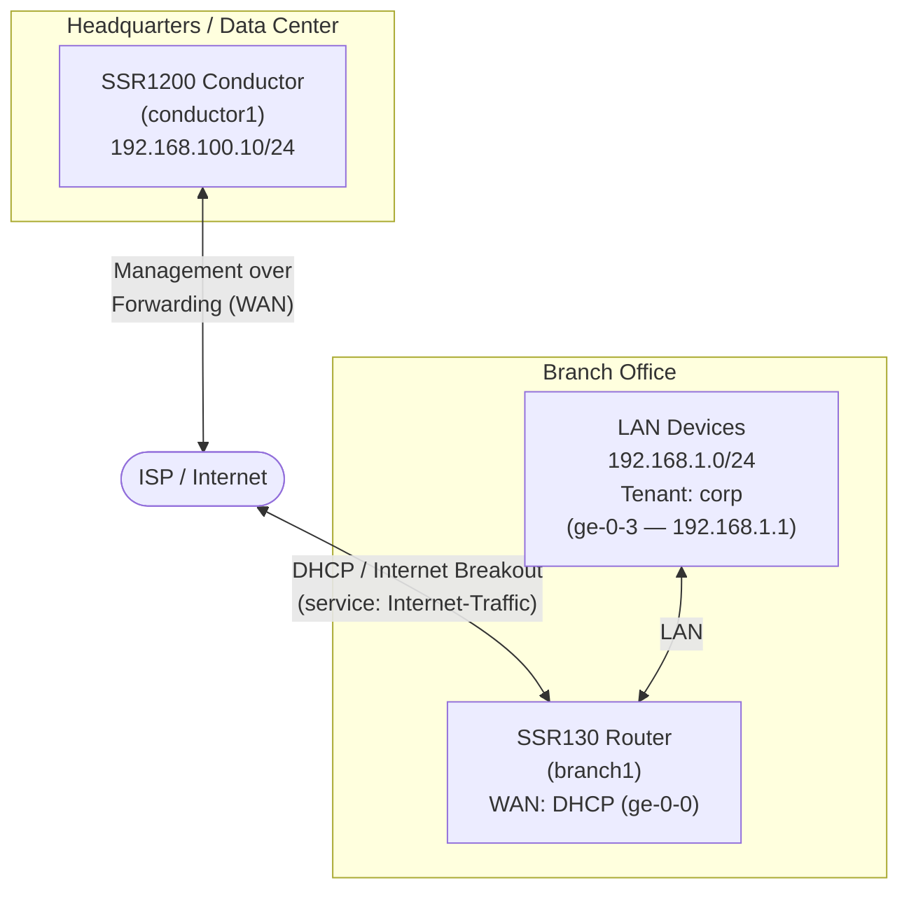

import Mermaid from '@theme/Mermaid';
import NetworkDesign from './_deploy_network_design.md';

This guide walks a network engineer through the steps required to deploy an **SSR1200 as a standalone Conductor** and ready to onboard branch routers. When you have completed the steps in this guide, the conductor will be running SSR 7.1.5-7r2, configured with an authority name, conductor address, and shared services that allow branch routers to onboard and begin forwarding traffic.

will have a configuration ready for each branch router to bring it online, managed by the conductor, forwarding internet traffic for LAN users, and reachable by the conductor over the same WAN interface used for internet breakout.

## Guide Sections

| Step | Topic | Description |
|------|-------|-------------|
| 1 | [Install the Conductor](deploy_hrdwr_conductor_install.mdx) | Install SSR 7.1.5-7r2 on an SSR1200 and initialize it as a standalone conductor |
| 2 | [Configure the Conductor](deploy_hrdwr_conductor_config.mdx) | Set the authority name, conductor address, internet service, and corporate tenant |
| — | [Appendix — Conductor Configuration](deploy_appendix_hrdwr_conductor.mdx) | Complete conductor PCLI configuration |

## Network Topology

The diagram below shows the logical network this guide builds.

## Roles

| Device | Model | Role |
|--------|-------|------|
| `conductor1` | SSR1200 | Standalone SSR Conductor — centralized management and provisioning |
| `branch1` | SSR130 | Conductor-managed branch router — internet breakout and LAN services |

## Network Design Reference

<NetworkDesign/>

## Prerequisites

Before beginning, ensure the following are available:

- **Juniper software access credentials** — Artifactory username and password for software downloads.
- **SSR 7.1.5-7r2 ISO image** — downloaded from [software.128technology.com](https://software.128technology.com/artifactory/list/generic-128t-isos-release-local/) using your Juniper software access credentials.
- **Bootable USB drive** — minimum 8 GB, prepared from the ISO. See [Creating a Bootable USB](intro_creating_bootable_usb.md).
- **Console access** — RJ-45 rollover cable or VGA/keyboard access to the SSR1200 for the initial installation.
- **Management network** — a network switch port providing DHCP or a known static IP for the SSR1200 MGMT port.
- **Static IP assignment for the conductor** — the IP address assigned to the conductor must be reachable from branch WAN links.

## Software Version Requirements

This guide targets **SSR 7.1.5-7r2** on both conductor and routers.

:::note
The router software version cannot be higher than the conductor software version. SSR130 routers that ship with an earlier software version are upgraded to 7.1.5-7r2 from the conductor after onboarding. See [Upgrading the Conductor](intro_upgrading.md) for general upgrade information.
:::

## Related Documentation

- [SSR Installation Overview](intro_installation.md)
- [Conductor Deployment Best Practices](bcp_conductor_deployment.md)
- [Service and Service Policy Design](bcp_service_and_service_policy_design.md)
- [Management Traffic over Forwarding Interfaces](config_management_over_forwarding.md)
- [Onboard an SSR Device to a Conductor](onboard_ssr_to_conductor.md)
