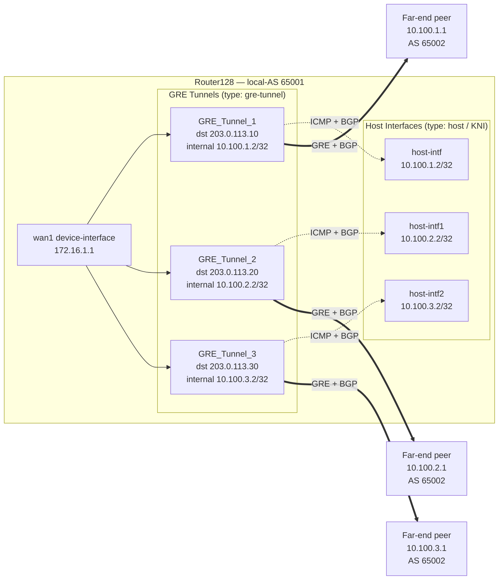

Cloud security and SD-WAN services — such as Akamai — commonly terminate customer traffic over Generic Routing Encapsulation (GRE) tunnels and monitor tunnel liveness by sending inbound ICMP echo requests (health checks) to the customer end of each tunnel. As described in [Native GRE Tunnels](config_gre_tunnel.md), an SSR `gre-tunnel` network-interface does not answer these inbound ICMP probes on its own, so the far-end service can mark an otherwise healthy tunnel as down.

This guide shows you how to make native GRE tunnels respond to inbound ICMP health checks and how to peer BGP passively over those same tunnels. The pattern uses a parallel `host`-type device interface (a Linux KNI) that shares the tunnel's internal address, so the Linux host stack answers the ICMP probes while the SSR forwarding plane continues to carry data traffic.

:::note
This guide applies to SSR 6.x and later, where native GRE tunnels are supported. Akamai is used only as a representative cloud service; the configuration is vendor-neutral. Replace the placeholder IP addresses and AS numbers with the values from your deployment.
:::

## Overview

SSR native GRE (`type gre-tunnel`) does not pass inbound ICMP echo requests to the Linux stack, so a health-checking peer receives no reply. The workaround is to create a `host`-type device interface (KNI) with the same IP address as the GRE tunnel's `internal-address`. The Linux host stack answers the ICMP echo replies, and SSR services steer inbound GRE and ICMP traffic into that host interface.

The same host interface also provides a stable source address for BGP. Because cloud services typically initiate the BGP TCP connection themselves, each neighbor is configured in passive mode: the SSR listens on TCP/179 and never initiates the session.

## Prerequisites

- SSR 6.x or later with native GRE tunnel support.
- A reachable WAN interface with a public or routable source address for the tunnels.
- The upstream firewall permits GRE (IP protocol 47) between the SSR WAN address and the cloud service endpoints.
- The MD5 authentication password for each BGP session, coordinated with the far-end peer.
- Prior familiarity with [Native GRE Tunnels](config_gre_tunnel.md) and [BGP](config_bgp.md).

## Topology

The example uses three GRE tunnels from a single router (`Router128`) to a cloud service. Each tunnel has a matching `host`-type interface that terminates ICMP health checks and sources BGP, and each tunnel carries one passive BGP session to the far-end peer.



*Topology: Router128 terminates three GRE tunnels on its WAN interface. Each tunnel pairs with a host-type KNI that shares the tunnel internal address to answer inbound ICMP health checks and source BGP. Each far-end peer in AS 65002 initiates a passive BGP session over its tunnel.*

## Why This Design

| Problem | Solution |
|---|---|
| A native GRE interface cannot respond to inbound ICMP health checks from the far-end. | Create a `host`-type device interface (KNI) with the same IP as the tunnel `internal-address`, so the Linux kernel answers ICMP. |
| The BGP TCP session needs a stable source address over the GRE path. | Bind the BGP transport `local-address` to the `host` network-interface that carries the tunnel internal address. |
| The SSR must not initiate the BGP TCP session; the far-end is always the active side. | Set `transport passive-mode true` on each BGP neighbor, and add BGP services and service-routes that steer inbound TCP/179 to the routing stack. |
| Each tunnel needs an isolated tenant and access policy. | Assign one tenant per GRE interface: `GRE_1_TENANT`, `GRE_2_TENANT`, and `GRE_3_TENANT`. |
| The BGP next-hop (each far-end tunnel IP) must be reachable through the correct GRE tunnel. | Add static /32 host routes that point each BGP neighbor IP out its corresponding GRE tunnel interface. |

## IP Address Plan

| GRE Tunnel | SSR WAN IP (Tunnel Source) | Tunnel Destination (Far-End) | SSR Internal Address | BGP Neighbor (Far-End) | Host Interface | Tenant |
|---|---|---|---|---|---|---|
| GRE_Tunnel_1 | 172.16.1.1 | 203.0.113.10 | 10.100.1.2/32 | 10.100.1.1 | host-intf | GRE_1_TENANT |
| GRE_Tunnel_2 | 172.16.1.1 | 203.0.113.20 | 10.100.2.2/32 | 10.100.2.1 | host-intf1 | GRE_2_TENANT |
| GRE_Tunnel_3 | 172.16.1.1 | 203.0.113.30 | 10.100.3.2/32 | 10.100.3.1 | host-intf2 | GRE_3_TENANT |

The SSR internal address is one IP in each pair; the far-end BGP neighbor is the other. This example uses the following BGP identifiers:

- SSR BGP local-AS: `65001`
- Far-end BGP AS: `65002`
- BGP router-ID: `172.16.1.1` (the WAN IP)

## Step 1: Configure Tenants

Create one tenant per GRE tunnel, plus one shared tenant for the host interfaces.

```text
config authority tenant GRE_1_TENANT name GRE_1_TENANT
config authority tenant GRE_2_TENANT name GRE_2_TENANT
config authority tenant GRE_3_TENANT name GRE_3_TENANT
config authority tenant host-intf-tenant1 name host-intf-tenant1
```

The `host-intf-tenant1` tenant is shared across all three host interfaces. It is used in the access policies for the inbound BGP services, so the routing stack (the BGP speaker) can reach the far-end BGP neighbors.

## Step 2: Configure GRE Tunnel Network Interfaces

Each GRE tunnel is a virtual network-interface on the physical WAN `device-interface` (`wan1`), with `type gre-tunnel`.

```text
config authority router Router128 node node1 device-interface wan1 network-interface GRE_Tunnel_1
    name                GRE_Tunnel_1
    type                gre-tunnel
    tenant              GRE_1_TENANT
    mtu                 1436
    enforced-mss        1280
    icmp                allow
    tunnel
        destination      203.0.113.10
        internal-address 10.100.1.2
        source address   172.16.1.1
    exit
exit
```

```text
config authority router Router128 node node1 device-interface wan1 network-interface GRE_Tunnel_2
    name                GRE_Tunnel_2
    type                gre-tunnel
    tenant              GRE_2_TENANT
    mtu                 1436
    enforced-mss        1280
    icmp                allow
    tunnel
        destination      203.0.113.20
        internal-address 10.100.2.2
        source address   172.16.1.1
    exit
exit
```

```text
config authority router Router128 node node1 device-interface wan1 network-interface GRE_Tunnel_3
    name                GRE_Tunnel_3
    type                gre-tunnel
    tenant              GRE_3_TENANT
    mtu                 1436
    enforced-mss        1280
    icmp                allow
    tunnel
        destination      203.0.113.30
        internal-address 10.100.3.2
        source address   172.16.1.1
    exit
exit
```

The MTU and MSS values account for GRE overhead on a standard 1500-byte WAN:

- The physical WAN MTU is 1500 bytes.
- GRE adds 24 bytes of overhead, leaving a 1476-byte tunnel MTU.
- The tunnel MTU is set to 1436 (conservative) to allow for IP options.
- `enforced-mss 1280` clamps the TCP MSS inside the tunnel to avoid fragmentation.

## Step 3: Configure Host Interfaces For ICMP And BGP Termination

Each `host`-type device-interface creates a Linux KNI whose IP address matches the corresponding GRE tunnel's `internal-address`. This lets the Linux kernel answer ICMP echo requests from the far-end health checks, and lets the BGP process source its TCP session from that IP.

```text
config authority router Router128 node node1 device-interface host-intf
    name        host-intf
    type        host
    enabled     true
    forwarding  true
    network-interface host-intf
        name            host-intf
        type            external
        tenant          host-intf-tenant1
        source-nat      false
        mtu             1500
        icmp            allow
        address 10.100.1.2
            ip-address      10.100.1.2
            prefix-length   32
            valid-waypoint  true
        exit
    exit
exit
```

```text
config authority router Router128 node node1 device-interface host-intf1
    name        host-intf1
    type        host
    enabled     true
    forwarding  true
    network-interface host-intf1
        name            host-intf1
        type            external
        tenant          host-intf-tenant1
        source-nat      false
        mtu             1500
        icmp            allow
        address 10.100.2.2
            ip-address      10.100.2.2
            prefix-length   32
            valid-waypoint  true
        exit
    exit
exit
```

```text
config authority router Router128 node node1 device-interface host-intf2
    name        host-intf2
    type        host
    enabled     true
    forwarding  true
    network-interface host-intf2
        name            host-intf2
        type            external
        tenant          host-intf-tenant1
        source-nat      false
        mtu             1500
        icmp            allow
        address 10.100.3.2
            ip-address      10.100.3.2
            prefix-length   32
            valid-waypoint  true
        exit
    exit
exit
```

:::important
Keep `source-nat false` on these interfaces. If source NAT is enabled, ICMP replies and BGP TCP are source-NATted before leaving, and the far-end sees the wrong source IP. Setting `valid-waypoint true` allows the SSR to use these addresses for SVR waypoint allocation if needed.
:::

## Step 4: Configure Inbound GRE And ICMP Services

Create one inbound service per tunnel. Each matches the tunnel's `internal-address` and allows both GRE and ICMP, so inbound health checks are steered to the corresponding host interface by a service-route (added in Step 7).

```text
config authority service gre-tunnel1-keepalive-return
    name         gre-tunnel1-keepalive-return
    description  gre-tunnel1-keepalive-return
    enabled      true
    scope        private
    transport gre
        protocol  gre
    exit
    transport icmp
        protocol  icmp
    exit
    address      10.100.1.2/32
    source-nat   disabled
    access-policy Internet
        source      Internet
        permission  allow
    exit
    access-policy GRE_1_TENANT
        source      GRE_1_TENANT
        permission  allow
    exit
exit
```

```text
config authority service gre-tunnel2-keepalive-return
    name         gre-tunnel2-keepalive-return
    description  gre-tunnel2-keepalive-return
    enabled      true
    scope        private
    transport gre
        protocol  gre
    exit
    transport icmp
        protocol  icmp
    exit
    address      10.100.2.2/32
    source-nat   disabled
    access-policy Internet
        source      Internet
        permission  allow
    exit
    access-policy GRE_2_TENANT
        source      GRE_2_TENANT
        permission  allow
    exit
exit
```

```text
config authority service gre-tunnel3-keepalive-return
    name         gre-tunnel3-keepalive-return
    description  gre-tunnel3-keepalive-return
    enabled      true
    scope        private
    transport gre
        protocol  gre
    exit
    transport icmp
        protocol  icmp
    exit
    address      10.100.3.2/32
    source-nat   disabled
    access-policy Internet
        source      Internet
        permission  allow
    exit
    access-policy GRE_3_TENANT
        source      GRE_3_TENANT
        permission  allow
    exit
exit
```

## Step 5: Configure Inbound BGP Services

These services match TCP/179 destined for the SSR tunnel internal address. Because the far-end peer initiates the BGP TCP connection and the SSR is passive, a service-route (added in Step 7) steers these sessions to the routing stack.

```text
config authority service bgp-inbound-tunnel1
    name        bgp-inbound-tunnel1
    enabled     true
    scope       private
    transport tcp
        protocol    tcp
        port-range 179
            start-port  179
            end-port    179
        exit
    exit
    address     10.100.1.2/32
    source-nat  disabled
    access-policy GRE_1_TENANT
        source      GRE_1_TENANT
        permission  allow
    exit
    access-policy Internet
        source      Internet
        permission  allow
    exit
exit
```

```text
config authority service bgp-inbound-tunnel2
    name        bgp-inbound-tunnel2
    enabled     true
    scope       private
    transport tcp
        protocol    tcp
        port-range 179
            start-port  179
            end-port    179
        exit
    exit
    address     10.100.2.2/32
    source-nat  disabled
    access-policy Internet
        source      Internet
        permission  allow
    exit
    access-policy GRE_2_TENANT
        source      GRE_2_TENANT
        permission  allow
    exit
exit
```

```text
config authority service bgp-inbound-tunnel3
    name        bgp-inbound-tunnel3
    enabled     true
    scope       private
    transport tcp
        protocol    tcp
        port-range 179
            start-port  179
            end-port    179
        exit
    exit
    address     10.100.3.2/32
    source-nat  disabled
    access-policy Internet
        source      Internet
        permission  allow
    exit
    access-policy GRE_3_TENANT
        source      GRE_3_TENANT
        permission  allow
    exit
exit
```

## Step 6: Configure Outbound BGP Services

These services support SSR-initiated BGP TCP connections toward the far-end neighbor IPs (`10.100.1.1`, `10.100.2.1`, and `10.100.3.1`). They are disabled (`enabled false`) because BGP runs in passive mode and the far-end peer always initiates the session. Keep them for documentation and as an active-mode fallback.

:::tip
If you need the SSR to initiate BGP as well (active mode), set `enabled true` on these services.
:::

```text
config authority service bgp-outbound-tunnel1
    name        bgp-outbound-tunnel1
    enabled     false
    scope       private
    security    internal
    transport tcp
        protocol    tcp
        port-range 179
            start-port  179
            end-port    179
        exit
    exit
    address     10.100.1.1/32
    source-nat  disabled
    access-policy _bgp_speaker_
        source      _bgp_speaker_
        permission  allow
    exit
    access-policy host-intf-tenant1
        source      host-intf-tenant1
        permission  allow
    exit
    access-policy GRE_1_TENANT
        source      GRE_1_TENANT
        permission  allow
    exit
    access-policy _internal_
        source      _internal_
        permission  allow
    exit
exit
```

```text
config authority service bgp-outbound-tunnel2
    name        bgp-outbound-tunnel2
    enabled     false
    scope       private
    security    internal
    transport tcp
        protocol    tcp
        port-range 179
            start-port  179
            end-port    179
        exit
    exit
    address     10.100.2.1/32
    source-nat  disabled
    access-policy _bgp_speaker_
        source      _bgp_speaker_
        permission  allow
    exit
    access-policy host-intf-tenant1
        source      host-intf-tenant1
        permission  allow
    exit
    access-policy _internal_
        source      _internal_
        permission  allow
    exit
    access-policy GRE_2_TENANT
        source      GRE_2_TENANT
        permission  allow
    exit
exit
```

```text
config authority service bgp-outbound-tunnel3
    name        bgp-outbound-tunnel3
    enabled     false
    scope       private
    security    internal
    transport tcp
        protocol    tcp
        port-range 179
            start-port  179
            end-port    179
        exit
    exit
    address     10.100.3.1/32
    source-nat  disabled
    access-policy _bgp_speaker_
        source      _bgp_speaker_
        permission  allow
    exit
    access-policy host-intf-tenant1
        source      host-intf-tenant1
        permission  allow
    exit
    access-policy _internal_
        source      _internal_
        permission  allow
    exit
    access-policy GRE_3_TENANT
        source      GRE_3_TENANT
        permission  allow
    exit
exit
```

## Step 7: Configure Service Routes

Service-routes are router-scoped and bind each service to a next-hop interface. The inbound GRE and ICMP services point to their host interfaces; the inbound BGP services point to the routing stack; the outbound BGP services point to their GRE tunnels.

```text
config authority router Router128 service-route gre-tunnel1-keepalive-sr
    name            gre-tunnel1-keepalive-sr
    service-name    gre-tunnel1-keepalive-return
    enable-failover false
    next-hop node1 host-intf
        node-name  node1
        interface  host-intf
    exit
exit

config authority router Router128 service-route gre-tunnel2-keepalive-sr
    name            gre-tunnel2-keepalive-sr
    service-name    gre-tunnel2-keepalive-return
    enable-failover false
    next-hop node1 host-intf1
        node-name  node1
        interface  host-intf1
    exit
exit

config authority router Router128 service-route gre-tunnel3-keepalive-sr
    name            gre-tunnel3-keepalive-sr
    service-name    gre-tunnel3-keepalive-return
    enable-failover false
    next-hop node1 host-intf2
        node-name  node1
        interface  host-intf2
    exit
exit
```

The inbound BGP service-routes send sessions to the local routing stack (FRR):

```text
config authority router Router128 service-route bgp-inbound-tunnel1-sr
    name            bgp-inbound-tunnel1-sr
    service-name    bgp-inbound-tunnel1
    enable-failover false
    routing-stack
exit

config authority router Router128 service-route bgp-inbound-tunnel2-sr
    name            bgp-inbound-tunnel2-sr
    service-name    bgp-inbound-tunnel2
    enable-failover false
    routing-stack
exit

config authority router Router128 service-route bgp-inbound-tunnel3-sr
    name            bgp-inbound-tunnel3-sr
    service-name    bgp-inbound-tunnel3
    enable-failover false
    routing-stack
exit
```

The outbound BGP service-routes send sessions out the matching GRE tunnel. They take effect only if you enable the outbound BGP services from Step 6:

```text
config authority router Router128 service-route bgp-outbound-tunnel1-sr
    name            bgp-outbound-tunnel1-sr
    service-name    bgp-outbound-tunnel1
    enable-failover false
    next-hop node1 GRE_Tunnel_1
        node-name  node1
        interface  GRE_Tunnel_1
    exit
exit

config authority router Router128 service-route bgp-outbound-tunnel2-sr
    name            bgp-outbound-tunnel2-sr
    service-name    bgp-outbound-tunnel2
    enable-failover false
    next-hop node1 GRE_Tunnel_2
        node-name  node1
        interface  GRE_Tunnel_2
    exit
exit

config authority router Router128 service-route bgp-outbound-tunnel3-sr
    name            bgp-outbound-tunnel3-sr
    service-name    bgp-outbound-tunnel3
    enable-failover false
    next-hop node1 GRE_Tunnel_3
        node-name  node1
        interface  GRE_Tunnel_3
    exit
exit
```

## Step 8: Configure Static Routes For BGP Next-Hop Reachability

The routing stack must resolve the BGP neighbor IPs (the far-end tunnel addresses) in the RIB. Because these /32 addresses are reachable only inside the GRE tunnels, add explicit static routes out each tunnel interface.

```text
config authority router Router128 routing default-instance
    static-route 10.100.1.1/32 1
        destination-prefix  10.100.1.1/32
        distance            1
        next-hop-interface node1 GRE_Tunnel_1
            node       node1
            interface  GRE_Tunnel_1
        exit
    exit
    static-route 10.100.2.1/32 1
        destination-prefix  10.100.2.1/32
        distance            1
        next-hop-interface node1 GRE_Tunnel_2
            node       node1
            interface  GRE_Tunnel_2
        exit
    exit
    static-route 10.100.3.1/32 1
        destination-prefix  10.100.3.1/32
        distance            1
        next-hop-interface node1 GRE_Tunnel_3
            node       node1
            interface  GRE_Tunnel_3
        exit
    exit
exit
```

:::caution
Without these static routes, the routing stack cannot resolve the BGP neighbor IP, and the session does not come up — even in passive mode.
:::

## Step 9: Configure The BGP Routing Protocol

Configure the global BGP settings, then one neighbor per tunnel. Each neighbor sources its session from the matching host interface and runs in passive mode.

```text
config authority router Router128 routing default-instance routing-protocol bgp
    type        bgp
    local-as    65001
    router-id   172.16.1.1
    timers
        hold-time           90
        keepalive-interval  30
    exit
    graceful-restart
        mode               helper
        restart-time       120
        stale-routes-time  360
    exit
    address-family ipv4-unicast
        afi-safi  ipv4-unicast
        network 192.168.100.0/24
            network-address  192.168.100.0/24
        exit
    exit
exit
```

The `network 192.168.100.0/24` statement advertises that prefix to the far-end peers. Configure the first neighbor over `GRE_Tunnel_1`, sourced from `host-intf`:

```text
    neighbor 10.100.1.1
        neighbor-address        10.100.1.1
        neighbor-as             65002
        local-as                65001
        shutdown                false
        auth-password           <MD5-password>
        timers
            hold-time                       240
            keepalive-interval              30
            connect-retry                   30
            minimum-advertisement-interval  30
        exit
        transport
            passive-mode             true
            bgp-service-generation   disabled
            local-address
                node       node1
                interface  host-intf
            exit
        exit
        multihop
            ttl  255
        exit
        bfd
            enable  false
        exit
        address-family ipv4-unicast
            afi-safi           ipv4-unicast
            activate           true
            send-default-route  false
            next-hop-self       false
        exit
    exit
```

Configure the second neighbor over `GRE_Tunnel_2`, sourced from `host-intf1`:

```text
    neighbor 10.100.2.1
        neighbor-address        10.100.2.1
        neighbor-as             65002
        local-as                65001
        shutdown                false
        auth-password           <MD5-password>
        timers
            hold-time                       240
            keepalive-interval              30
            connect-retry                   30
            minimum-advertisement-interval  30
        exit
        transport
            passive-mode             true
            bgp-service-generation   disabled
            local-address
                node       node1
                interface  host-intf1
            exit
        exit
        multihop
            ttl  255
        exit
        bfd
            enable  false
        exit
        address-family ipv4-unicast
            afi-safi           ipv4-unicast
            activate           true
            send-default-route  false
            next-hop-self       false
        exit
    exit
```

Configure the third neighbor over `GRE_Tunnel_3`, sourced from `host-intf2`:

```text
    neighbor 10.100.3.1
        neighbor-address        10.100.3.1
        neighbor-as             65002
        local-as                65001
        shutdown                false
        auth-password           <MD5-password>
        timers
            hold-time                       240
            keepalive-interval              30
            connect-retry                   30
            minimum-advertisement-interval  30
        exit
        transport
            passive-mode             true
            bgp-service-generation   disabled
            local-address
                node       node1
                interface  host-intf2
            exit
        exit
        multihop
            ttl  255
        exit
        bfd
            enable  false
        exit
        address-family ipv4-unicast
            afi-safi           ipv4-unicast
            activate           true
            send-default-route  false
            next-hop-self       false
        exit
    exit
```

:::important
Set `bgp-service-generation disabled` on each neighbor. If it is enabled, the SSR auto-generates a BGP service that conflicts with the services you created in Step 5, and the session may establish and then immediately drop.
:::

## Verification

Confirm the physical WAN device-interface is up first, because the GRE tunnels ride on it:

```bash
show device-interface router Router128 name wan1
```

The `oper-status` should be `up`.

Confirm the GRE tunnel network-interfaces are up:

```bash
show network-interface router Router128 name GRE_Tunnel_1
show network-interface router Router128 name GRE_Tunnel_2
show network-interface router Router128 name GRE_Tunnel_3
```

Each `oper-status` should be `up`.

Confirm the host interfaces are up:

```bash
show device-interface router Router128 name host-intf
show device-interface router Router128 name host-intf1
show device-interface router Router128 name host-intf2
```

Test the ICMP health-check response. From the far-end, ping the SSR tunnel internal address (for example, `10.100.1.2`). The reply comes from the Linux host interface KNI, not from the GRE interface. To test from the SSR side, ping the far-end neighbor IP:

```bash
ping 10.100.1.1 router Router128
```

Verify the BGP sessions:

```bash
show bgp neighbors router Router128
```

The expected state is `Established` for all three neighbors. Because `passive-mode` is `true`, a session comes up only after the far-end initiates the TCP connection.

Verify the FIB entries for BGP. Look for entries matching `10.100.1.2/32`, `10.100.2.2/32`, and `10.100.3.2/32` with TCP/179 under `host-intf-tenant1`, pointing to the internal control-message service:

```bash
show fib router Router128
```

Check the service sessions:

```bash
show sessions router Router128 service-name bgp-inbound-tunnel1
show sessions router Router128 service-name gre-tunnel1-keepalive-return
```

## Design Notes And Caveats

**Native GRE and ICMP limitation.** The `gre-tunnel` network-interface type does not pass ICMP echo requests to the Linux stack, so a pinging host receives no reply. The `host`-type KNI with the same IP is the workaround. The GRE interface still sets `icmp allow` to permit ICMP to transit the tunnel; the host interface is what terminates and answers the ICMP.

**Passive mode means the SSR listens only.** With `transport passive-mode true`, the SSR opens a listening socket on TCP/179 bound to the `local-address` interface and never sends a TCP SYN toward the neighbor. The far-end peer must always initiate the connection, and BGP does not come up until it does.

**MD5 authentication.** All three BGP sessions use `auth-password`. Configure the same password on both the SSR and the far-end peer.

**MTU and MSS.** GRE adds 24 bytes of overhead over the 1500-byte WAN MTU. The tunnel MTU is set to 1436 (conservative, allowing for IP options), and `enforced-mss 1280` clamps the TCP MSS — this is important for BGP to avoid fragmentation.

**Separate tenants per tunnel.** Each GRE interface has its own tenant, so traffic arriving on `GRE_Tunnel_1` is tenant `GRE_1_TENANT` and can reach only services whose access policy allows that tenant. This isolation prevents cross-tunnel BGP or ICMP leakage.

**Static routes for neighbor reachability.** The far-end BGP neighbor IPs are not directly connected in the routing table. Without the static /32 routes through the GRE interfaces, the routing stack cannot resolve the next-hop and does not bring up the session.

## Troubleshooting Quick Reference

| Symptom | Check |
|---|---|
| GRE tunnel stays down. | Verify the WAN interface is up, confirm the tunnel source and destination are correct, and check that the upstream firewall permits GRE (IP protocol 47). |
| ICMP probe from the far-end gets no reply. | Confirm the host interface is up, verify the `gre-tunnel1-keepalive-return` service exists with `access-policy Internet allow`, verify the service-route points to `host-intf`, and check `icmp allow` on both the GRE and host interfaces. |
| BGP stays in the `Active` state. | Because `passive-mode true` means the SSR waits, verify the far-end peer is configured to connect to the SSR, confirm the inbound TCP/179 service-route uses `routing-stack`, and check that the static route for the neighbor IP exists. |
| BGP flaps immediately after connecting. | Check that `bgp-service-generation disabled` is set, confirm the MD5 password matches, and review the MTU and MSS, since the BGP OPEN packet may be fragmented. |
| BGP is established but no routes are received. | Check that `address-family ipv4-unicast activate true` is set on the neighbor, and verify the far-end peer is advertising routes. |
| The BGP source IP is wrong. | Verify that `transport local-address interface` matches the correct tunnel's host interface. |
| A packet capture shows GRE but no ICMP reply. | The host interface KNI is likely down or the service-route is missing; run `show device-interface router Router128 name host-intf`. |

## Related Topics

- [Native GRE Tunnels](config_gre_tunnel.md)
- [BGP](config_bgp.md)
- [Autogenerated Services and Service Routes](config_autogenerated.md)
- [Service Health Learning and Fault Avoidance](config_service_health.md)
- [Path MTU Discovery and MSS Enforcement](config_pmtu.md)
