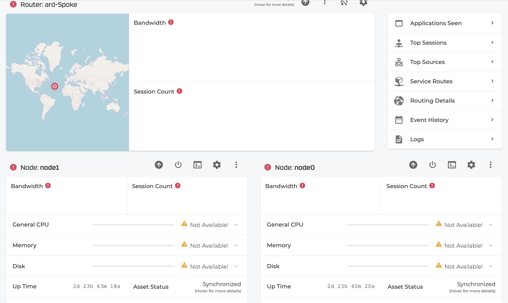

Users assigned the admin role (other than the default `admin` user) encounter "HTTP 401 Unauthorized" errors when accessing router views, logs, or FIB tables via the Conductor Web UI.

<!-- truncate -->

**Issue ID:** I95-66127
**Last Updated:** 2026-09-18  
**Introduced in SSR Version:** 7.1.6  

### Problem

When logged into the Conductor Web UI using an account configured with the `admin` role other than the built-in default `admin` account—users may encounter persistent **401 Authorization Required** or **401 Unauthorized** errors when viewing or refreshing router-specific monitoring and diagnostic pages.

The built-in default `admin` user account uses a pre-established trust session and is unaffected by this issue.

### Release Notes

### Severity
**Major**  
*Could seriously affect system operation, maintenance, administration, and related monitoring tasks.*

| Attribute | Details |
| :--- | :--- |
| **Status** | Resolved |
| **Resolved In** | [7.1.7](/docs/release_notes_128t_7.1#Release-7.1.7-15-sts) |
| **Product** | SSR Conductor & Routers |
| **Functional Area** | Web GUI / RBAC / Authentication Service (`dredd`) |

### Workaround

Juniper provides the following workaround until the system is upgraded to a resolved release:

- **Use the Built-in `admin` Account:** Log in to the Conductor Web UI directly using the default built-in `admin` user when monitoring managed routers, reviewing router logs, or inspecting FIB tables.
